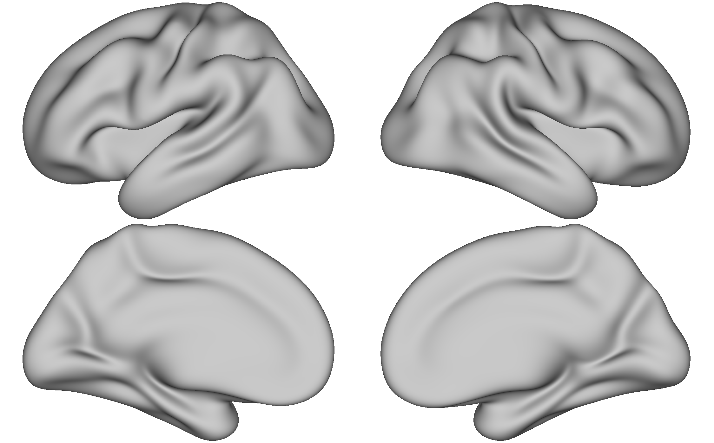
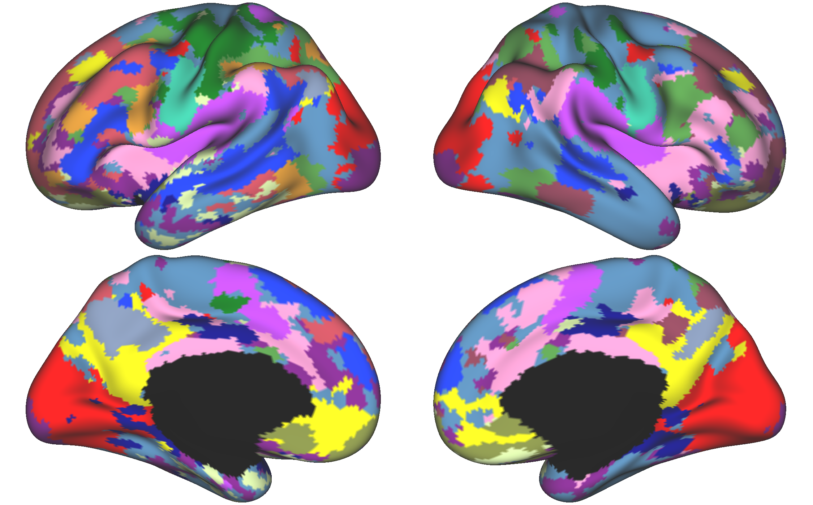

K-means Parc Step 3: Hungarian Matching and Visualization
=========================================================

Step 3 Overview 
***************

Once you have generated the individual parcellations, a few steps remain before you can visualize the output. These include Hungarian matching (particularly if you desire to use the same labels as previously published research), parc2annot, annot2gii, and then visualization in Workbench.

Hungarian Matching 
******************

Similar to the Kong2019 mataching step, we will match to the Yeo2011 17 network solution. The reference file for the fsaverage6 `17 network parcellation <https://github.com/peter3200/NeuroDocs/blob/8c7b342e7a5bd9dedf2a368242f174257ba546cc/example_data/17Network_Reference_FS6_Labels_220808.mat>`_ is hosted on Github.

The matching is implemented in MATLAB/r2018b. 

.. code-block:: matlab 
    
    %Purpose: Implement Hungarian Matching Algorithm for MSHBM and k-means parcellations 
    %parcellations.
    %Inputs: MSHBM and k-means parcellations (run directly following
    %parcellation BEFORE visualization)
    %Outputs: Individual parcellations with matched values (e.g., network 1 is the same across parcellation methods. 
    %
    %To run: 1. Open Matlab using salloc (ex: `salloc --mem-per-cpu 6G --time 2:00:00 --x11`)
    %	 2. source your config file containing the $CBIG_CODE_DIR variable
    %	 3. `cd` to the $CBIG_CODE_DIR/stable_projects/brain_parcellation/Kong2019_MSHBM/step3... folder
    % 	 4. `cp` this script over to the step3 folder in the CBIG repo
    %	 5. Enter the command `ml matlab/r2018b`
    %	 6. Enter the command `LD_PRELOAD= matlab`
    %	 7. In Matlab: Pull up this script and choose "Run" (green button)
    %	
    % Written by M. Peterson, Nielsen Brain and Behavior Lab under MIT License
    % 2022.

    %% Set paths and variables -EVEN RUNS
        %k-means project_dir
        project_dir_k = '/fslgroup/fslg_spec_networks/compute/results/MSC_analysis/parc_output_fs6_MSC_EVEN_GROUP/quant_metrics/kmeans';
        
        %subject list
        sublist = ["MSC01" "MSC02" "MSC03" "MSC04" "MSC05" "MSC06" "MSC07" "MSC08" "MSC09" "MSC10"];

    %% K-means matching -EVEN RUNS
    for sub = sublist
        %load kmeans parcellation
        sub_filename = strcat('sub-', sub, '_kmeans_k17_labels.mat');
        input_file = fullfile(project_dir_k,sub_filename);
        
        %load reference
        ref_file = '/fslgroup/fslg_spec_networks/compute/results/fsaverage_surfaces/17Network_Reference_FS6/17Network_Reference_FS6_Labels_220808.mat';

        %output file name
        output_file = fullfile(project_dir_k, strcat('sub-', sub, '_kmeans_k17_matchedlabels.mat'));
        
        % Implement CBIG Hungarian Cluster Match Surf Wrapper Script
        CBIG_HungarianClusterMatchSurfWrapper(char(ref_file), char(input_file), char(output_file));
    end

Parcellation to Annotation File 
*******************************

Next, we can go ahead and converted the matched parcellations from a .mat file to a FreeSurfer annotation file. The annotation file contains information regarding the colors for the labels, which will be helpful when it converted to GIFTI format. 

This step is also implemented in MATLAB. 

.. code-block:: matlab 

    % Script to turn parcellation files into FreeSurfer annotation
    % files. Then you can calculate surface area of parcellations!
    %
    % Assumes ind_parcellation output from Kong2019 CBIG pipeline.
    % Written by M. Peterson, Nielsen Brain and Behavior Lab

    %To run: 
    %	 1. Claim computing resources using salloc (ex: `salloc --mem-per-cpu 6G --time 2:00:00 --x11`)
    %    2. Source your CBIG config file to set up CBIG environment.	 
    %    3. Load matlab module: `ml matlab/r2018b`
    %	 4. Enter the command `LD_PRELOAD= matlab`

    %% MSC EVEN
    project_dir = '/fslgroup/fslg_spec_networks/compute/results/MSC_analysis/parc_output_fs6_MSC_EVEN_GROUP/quant_metrics/kmeans';
    out_dir = '/fslgroup/fslg_spec_networks/compute/results/MSC_analysis/parc_output_fs6_MSC_EVEN_GROUP/quant_metrics/kmeans';
    sublist = ["MSC01" "MSC02" "MSC03" "MSC04" "MSC05" "MSC06" "MSC07" "MSC08" "MSC09" "MSC10"];

    for sub = sublist
        sub_filename = strcat('sub-', sub, '_kmeans_k17_matchedlabels.mat');
        file = fullfile(project_dir,sub_filename);
        lh_name = strcat('sub-',sub,'_kmeans_lh.annot');
        rh_name = strcat('sub-',sub,'_kmeans_rh.annot');
        lh_output_file = fullfile(out_dir,lh_name);
        rh_output_file = fullfile(out_dir,rh_name);
        CBIG_SaveParcellationToFreesurferAnnotation(file, lh_output_file, rh_output_file);
    end

Annotation to GIFTI File 
************************

Once the parcellation is in a FreeSurfer format, it is easy to convert it to other formats, such as the GIFTI format for Workbench viewing. To convert the files from annotation to GIFTI format, we will use a bash script. 

.. code-block:: bash 

    #!/bin/bash
    #Purpose: Create surface and label files - compatible with workbench - from individual parcellation files
    #Inputs: freesurfer output and parc2annot annotation files
    #Outputs: .surf.gii surface and .label.gii parcellation files
    #Written by M. Peterson, Nielsen Brain and Behavior Lab under MIT License 2022

    #SET PATHS
    HOME=/fslgroup/fslg_spec_networks/compute
    CODE=${HOME}/code/MSC_analysis_group/kmeans_fs6/kmeans_vis
    OUTDIR=${HOME}/results/MSC_analysis/parc_output_fs6_MSC_EVEN_GROUP/quant_metrics/kmeans
    mkdir -p ${OUTDIR}

    #Create .surf.gii surface files and .label.gii parcellation files
    for SUB in `cat $CODE/subjids.txt`; do
        #Resample LH annot
        mri_surf2surf --srcsubject fsaverage --sval-annot ${OUTDIR}/${SUB}_kmeans_lh.annot --trgsubject fsaverage6 --hemi lh --trgsurfval ${OUTDIR}/${SUB}_fs6_lh --trg_type annot
        #Resample RH annot
        mri_surf2surf --srcsubject fsaverage --sval-annot ${OUTDIR}/${SUB}_kmeans_rh.annot --trgsubject fsaverage6 --hemi rh --trgsurfval ${OUTDIR}/${SUB}_fs6_rh --trg_type annot
        #LH label
        mris_convert --annot ${OUTDIR}/${SUB}_fs6_lh.annot ${FREESURFER_HOME}/subjects/fsaverage6/surf/lh.white ${OUTDIR}/${SUB}_kmeans_fs6_lh.label.gii
        #RH label
        mris_convert --annot ${OUTDIR}/${SUB}_fs6_rh.annot ${FREESURFER_HOME}/subjects/fsaverage6/surf/rh.white ${OUTDIR}/${SUB}_kmeans_fs6_rh.label.gii
    done

HCP Workbench Visualization 
***************************

After the parcellations are converted to GIFTI format, we can go ahead and visualize them in wb_view, part of the HCP Workbench package. 

The GIFTI parcellations are simple to load in HCP Workbench. First, load your surface underlays (fsaverage6 surface files are available on GitHub https://github.com/peter3200/NeuroDocs/tree/main/example_data). Next, load your GIFTI parcellation files.

Here is an image of the loaded surface underlays. 

And here is the individual parcellation!

