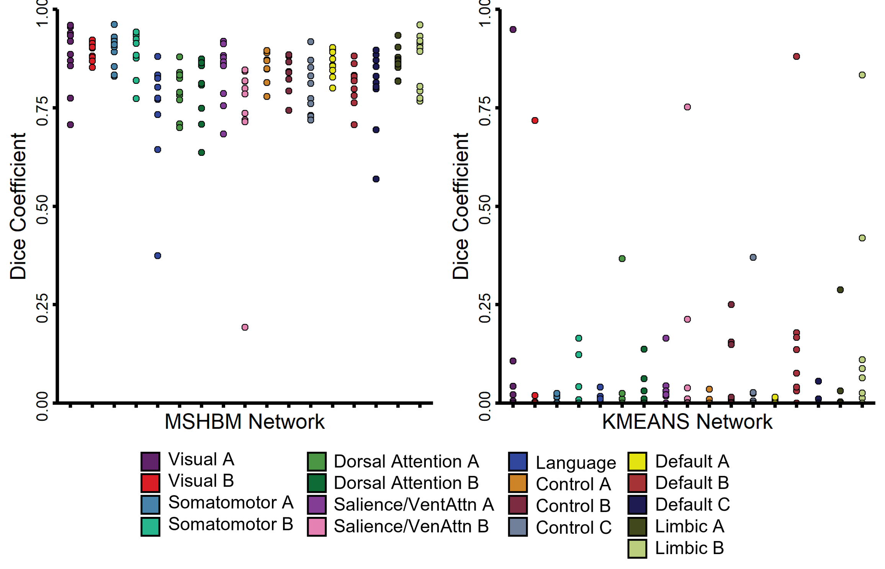
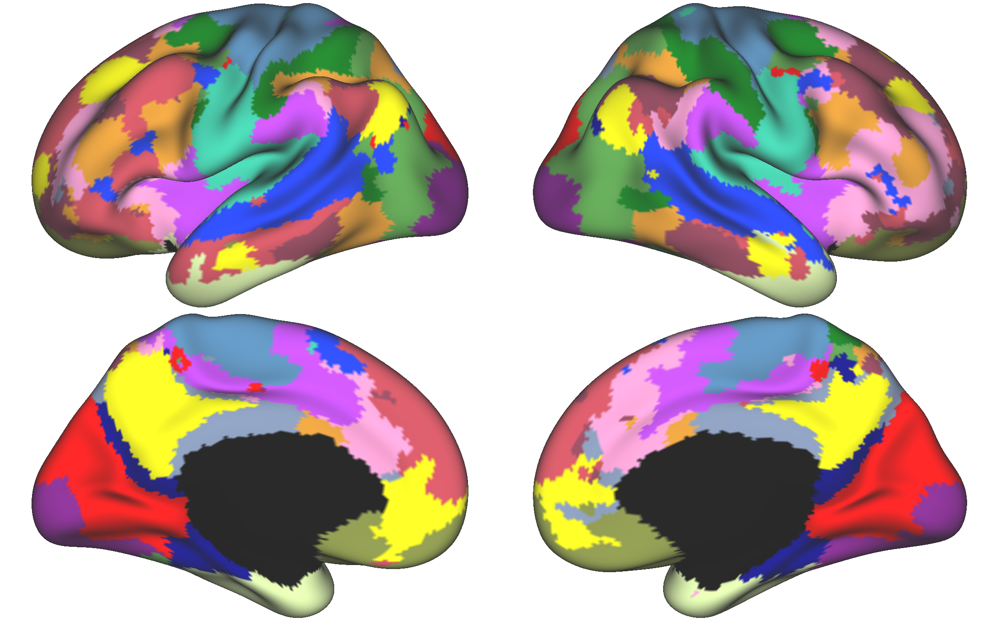
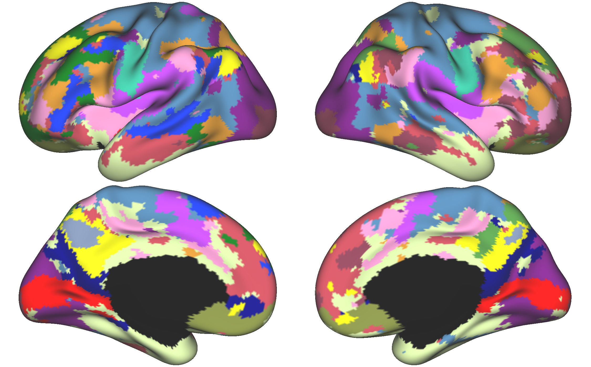

K-means Parcellation Overview
=============================

Introduction to k-means
***********************

The K-means algorithm is a clustering function that assigns each observation to exactly one of k clusters, resulting in a forced winner-takes-all parcellation, over the course of five steps.

1. A k-means ++ algorithm finds the initial cluster centers (cewntroids) for each initialization
2. Point-to-cluster-centroid distances are computed between each observation and each centroid
3. The algorithm proceeds to either batch update (assign each observation to the cluster with the closest centroid) or online update (individually assign observations to a different centroid if the reassignment decreases the sum of the within-cluster, sum-of-squares point-to-cluster-centroid distances)
4. The average of the observations in each cluster is computed to obtain k new centroid locations
5. Steps 2-4 are repeated until cluster assignments fail to change or the maximum number of iterations is reached

.. note:: The k-means algorithm is used for much more than network parcellations. See the MATLAB MathWorks documentation for more details on uses and parameters: https://www.mathworks.com/help/stats/kmeans.html

Pros and Cons 
*************

Why use k-means for individual parcellations? There are several pros and cons to consider. 

On the upshot, the k-means algorithm is completely data-driven, meaning that there are no constraints placed on the data other than the number of clusters. This is important since other parcellation algorithms (such as the MS-HBM approach) utilize group-based parameters to shape the parcellations, which means that the resulting parcellations won't necessarily be reflective of an individual's data. Additionally, as will be demonstrated in this tutorial, the k-means function is relatively easy to implement and may not require as many processing resources as other approaches.

However, according to our analyses using the Midnight Scan Club dataset, the k-means approach appears to be much less reliable than the MS-HBM parcellation approach. To arrive at this conclusion, we created separate individual parcellations (k-means and Kong2019 MS-HBM) using the odd- and even-numbered runs from MSC participants. Then, we calculated a dice coefficient for each network for each participant to compare the overlap between the parcellations. A higher dice coefficient indicates greater overlap and reliability. As shown below, the difference in reliability between the two parcellation methods is stark!

Examples of the k-means Parcellation in the Literature 
******************************************************

The k-means method has been used previously in the literature to successfully identify the canonical language network and default networks A and B (Braga et al., 2020; Braga & Buckner, 2017; DiNicola et al., 2020). 

Braga, R. M., & Buckner, R. L. (2017). Parallel interdigitated distributed networks within the individual estimated by intrinsic functional connectivity. Neuron, 95(2), 457-471.e5. https://doi.org/10.1016/j.neuron.2017.06.038
Braga, R. M., DiNicola, L. M., Becker, H. C., & Buckner, R. L. (2020). Situating the left-lateralized language network in the broader organization of multiple specialized large-scale distributed networks. Journal of Neurophysiology, 124(5), Art. 5. https://doi.org/10.1152/jn.00753.2019
DiNicola, L. M., Braga, R. M., & Buckner, R. L. (2020). Parallel distributed networks dissociate episodic and social functions within the individual. Journal of Neurophysiology, 123(3), Art. 3. https://doi.org/10.1152/jn.00529.2019

Expected Output 
***************

To give the reader an idea as to what to expect, below are individual parcellations for the same individual (MSC-01, odd runs). 

Kong2019 MS-HBM 

K-means 

Prerequisite Software 
*********************

We will be using the MATLAB kmeans function, so MATLAB is the main prerequisite. All other softwares are used for preprocessing or visualization.

* MATLAB version r2018b
* CBIG repository (visualization)
* FreeSurfer (visualization)
* HCP Workbench wb_view (visualization)

Prerequisite Processing 
***********************

Prior to generating the individual parcellations, we recommend generating surface reconstructions and performing any desired preprocessing steps. 

* FreeSurfer recon-all 
* CBIG2016 preprocessing (or any other pipeline with projection to fsaverage6 surface)

Workflow Steps 
**************

Once preprocessing is completed, we can begin the parcellation pipeline. The workflow consists of the following steps. 

1. Concatenate timeseries 
2. k-means function 
3. Hungarian matching and visualization 