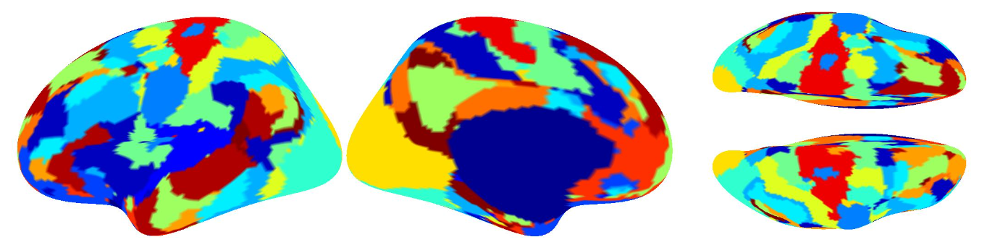
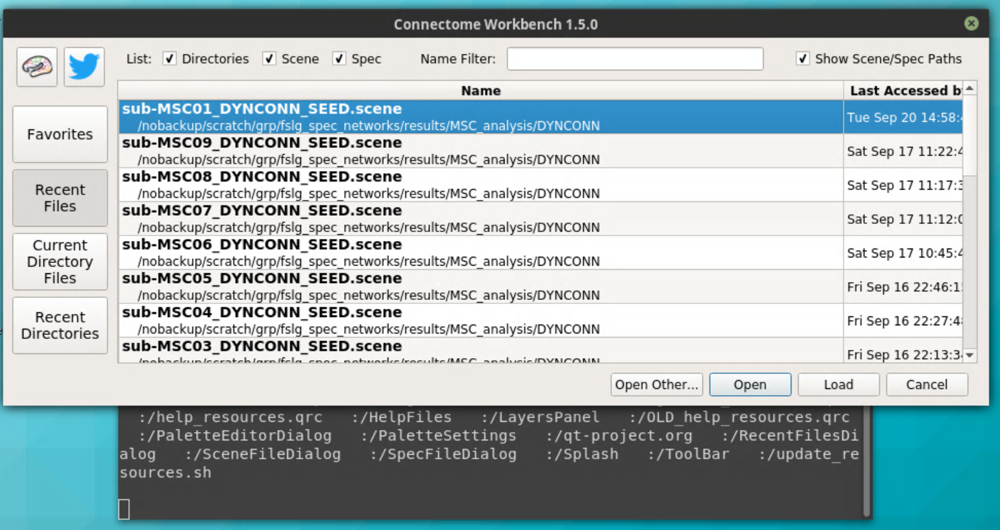
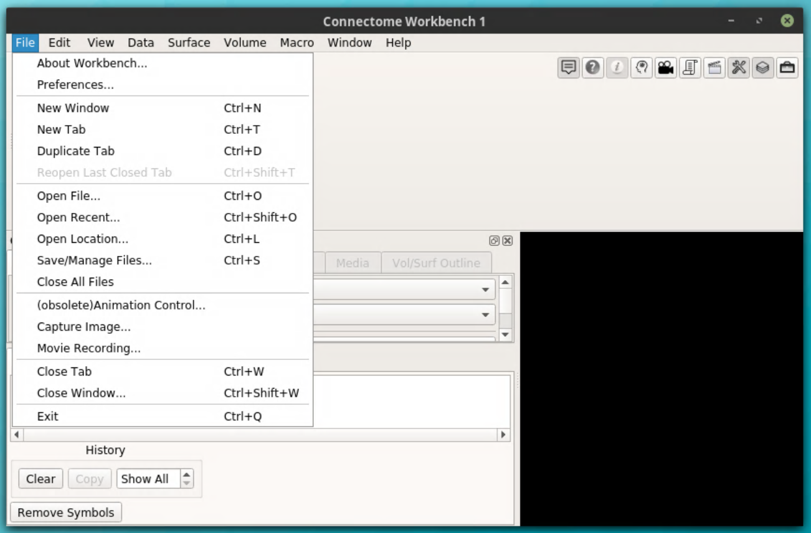
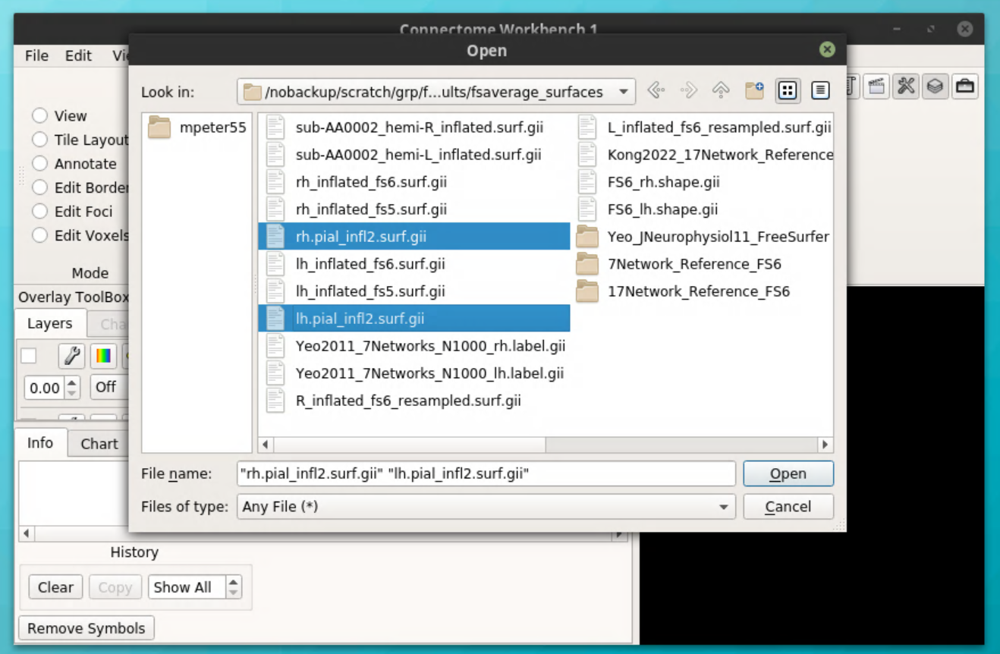
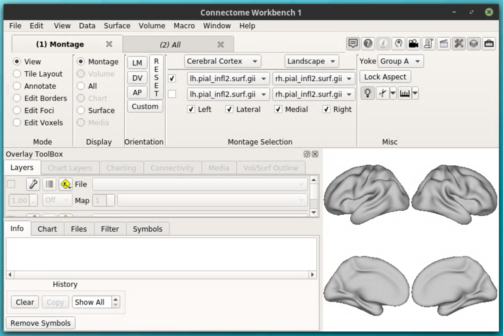
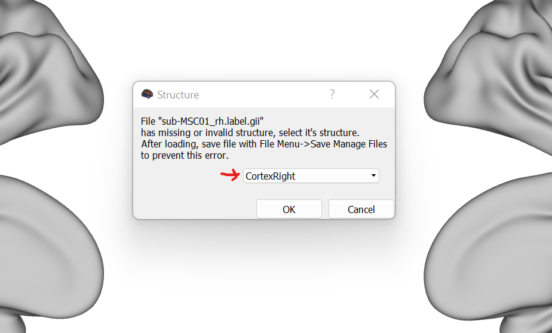
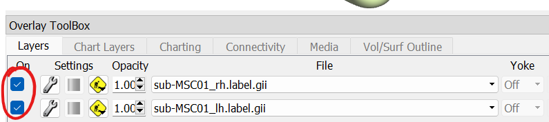
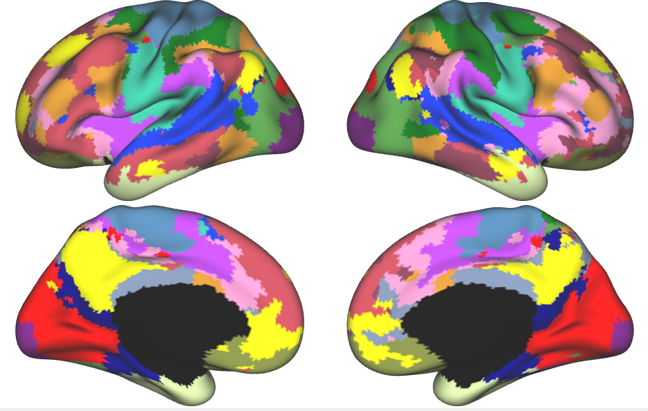

Kong2019 Parc Step 4
====================

Hungarian Matching Algorithm
****************************

Before working with the individual and group parcellations, it is *imperative* that you run the Hungarian Matching algorithm. This will align the parcellation labels that you generated with those previously canonized (aka, the Yeo or Kong2019 parcellations). 

To do this, we will use MATLAB r2018b. If you haven't used MATLAB in a supercomputing environment before, please see the tutorial (https://neurodocs.readthedocs.io/en/latest/misc/matlab.html). 

Reference files for the fsaverage6 `17 network parcellation <https://github.com/peter3200/NeuroDocs/blob/8c7b342e7a5bd9dedf2a368242f174257ba546cc/example_data/17Network_Reference_FS6_Labels_220808.mat>`_ and `7 network parcellation <https://github.com/peter3200/NeuroDocs/blob/8c7b342e7a5bd9dedf2a368242f174257ba546cc/example_data/7Network_Reference_FS6_Labels_220808.mat>`_ are hosted on Github.

.. code-block:: matlab 
    
    %Purpose: Implement Hungarian Matching Algorithm for MSHBM and k-means parcellations 
    %parcellations.
    %Inputs: MSHBM and k-means parcellations (run directly following
    %parcellation BEFORE visualization)
    %Outputs: Individual parcellations with matched values (e.g., network 1 is the same across parcellation methods. 
    %
    %To run 1. Open Matlab using salloc (ex: `salloc --mem-per-cpu 6G --time 2:00:00 --x11`)
    %	 2. source your config file containing the $CBIG_CODE_DIR variable
    %	 3. `cd` to the $CBIG_CODE_DIR/stable_projects/brain_parcellation/Kong2019_MSHBM/step3... folder
    % 	 4. `cp` this script over to the step3 folder in the CBIG repo
    %	 5. Enter the command `ml matlab/r2018b`
    %	 6. Enter the command `LD_PRELOAD= matlab`
    %	 7. In Matlab: Pull up this script and choose "Run" (green button)
    %	
    % Written by M. Peterson, Nielsen Brain and Behavior Lab under MIT License
    % 2022.

    %% Set paths and variables
        %mshbm project_dir
        project_dir_m = '/fslgroup/fslg_autism_networks/compute/HBN_analysis/parc_output_fs6_HBN/generate_individual_parcellations/ind_parcellation/test_set'; #location of individual parcellations

    %% HCPD Runs
    for sub = 1:1466 #number of subjects with individual parcellations
    
        %load MSHBM parcellations
        sub_str = num2str(sub);
        sub_filename = strcat('Ind_parcellation_MSHBM_sub',sub_str,'_w200_MRF30.mat'); #name of individual parcellation files
        input_file = fullfile(project_dir_m,sub_filename);
        
        %load reference
        ref_file = '/fslgroup/fslg_spec_networks/compute/results/fsaverage_surfaces/17Network_Reference_FS6/17Network_Reference_FS6_Labels_220808.mat'; #Reference file=file with canonized parcellations such as a Yeo 2011 parcellation. 
        
        %output file name
        output_file = fullfile(project_dir_m, strcat('Ind_parcellation_MSHBM_sub', sub_str, '_w200_MRF30_matched.mat'));
        
        % Implement CBIG Hungarian Cluster Match Surf Wrapper Script
        CBIG_HungarianClusterMatchSurfWrapper(char(ref_file), char(input_file), char(output_file));
        
    end    

.. note:: The same code can be adapted for group parcellations--just remove the for loop and edit the paths and subject name to reflect the group.mat parcellation.

Visualize Parcellations in MATLAB
*********************************

MATLAB can be handy to provide a quick visualization of the individual parcellations as a surface-level litmus test, particularly if you *haven't* run the Hungarian Matching algorithm yet.

.. code-block:: matlab 

    %Full path to parcellation you want to visualize.
    my_par = load('/fslgroup/fslg_spec_networks/compute/results/parc_test_output_MP2/estimate_group_priors/group/group.mat');
    %Full path to reference parcellation 
    ref_par = load(fullfile(getenv('CBIG_CODE_DIR'),'/stable_projects/brain_parcellation/Kong2019_MSHBM/examples/results/estimate_group_priors/group/group.mat'));
    %Cluster algorithm (does not save results of algorithm)
    [output, assign, cost, dice_overlap] = CBIG_HungarianClusterMatch([ref_par.lh_labels; ref_par.rh_labels], [my_par.lh_labels; my_par.rh_labels], 1);
    colors_old=ref_par.colors(2:end,:);
    colors_new=colors_old(assign,:);
    colors_new=[[0,0,0];colors_new];
    %Use CBIG function to draw the parcellation on a surface 
    CBIG_DrawSurfaceMaps(my_par.lh_labels, my_par.rh_labels, 'fsaverage5', 'inflated',-Inf,Inf,colors_new);

The resulting image will look something like the following.

Visualize Parcellations in Workbench 
************************************

To create beautiful visualizations in the HCP Workbench application, we will need to convert the parcellations in Fressurfer's annotation (.annot) file format and then convert this into GIFTI (.gii) format. 

Parc2Annot 
----------

To convert the .mat parcellations to .annot we will use MATLAB.

.. code-block:: matlab 

    % Wrapper script to turn parcellation files into FreeSurfer annotation
    % files. Then you can calculate surface area of parcellations!
    %
    % Assumes ind_parcellation output from Kong2019 CBIG pipeline.
    % Written by M. Peterson, Nielsen Brain and Behavior Lab
    %To run
    %	 1. Claim computing resources using salloc (ex: `salloc --mem-per-cpu 6G --time 2:00:00 --x11`)
    %    2. Source your CBIG config file to set up CBIG environment.	 
    %    3. Load matlab module: `ml matlab/r2018b`
    %	 4. Enter the command `LD_PRELOAD= matlab`

    %% HCPD
    project_dir = '/fslgroup/fslg_HBN_preproc/compute/HCPD_analysis/parc_output_fs6_HCPD/generate_individual_parcellations/ind_parcellation/test_set';
    out_dir = '/fslgroup/fslg_HBN_preproc/compute/HCPD_analysis/parc_output_fs6_HCPD/quant_metrics/MSHBM_vis';

    % Create output directory
    if(~exist(out_dir))
            mkdir(out_dir);
    end

    for sub = 1:616 %loop through each subject with a parcellation 
        sub_str = num2str(sub);
        sub_filename = strcat('Ind_parcellation_MSHBM_sub',sub_str,'_w200_MRF30_matched.mat'); %individual parcellation file names
        file = fullfile(project_dir,sub_filename);
        lh_name = strcat('sub-',sub_str,'_lh.annot');
        rh_name = strcat('sub-',sub_str,'_rh.annot');
        combo = strcat('sub-',sub_str);
        lh_output_file = fullfile(out_dir,lh_name);
        rh_output_file = fullfile(out_dir,rh_name);
        CBIG_SaveParcellationToFreesurferAnnotation(file, lh_output_file, rh_output_file);
    end

Annot2Gii 
---------

Next, we will convert the .annot files to GIFTI format. These gift files will then be compatible with Workbench and we can visualize them on a surface. To do this, we will use bash.

.. code-block:: bash 

    #!/bin/bash

    #Purpose: Create label files in fs6 space - from individual parcellation files
    #Inputs: parc2annot annotation files
    #Outputs: .label.gii parcellation files
    #Written by M. Peterson, Nielsen Brain and Behavior Lab under MIT License 2022

    #SET PATHS
    HOME=/fslgroup/fslg_spec_networks/compute
    HOME_D=/fslgroup/fslg_HBN_preproc/compute
    CODE_DIR=${HOME}/code/HCPD_analysis/Kong2019_parc_fs6
    OUTDIR=${HOME_D}/HCPD_analysis/parc_output_fs6_HCPD/quant_metrics/MSHBM_vis

    #.surf.gii files can be created using mris_convert on the $FREESURFER_HOME/subjects/fsaverage6/surf inflated files

    #Create .label.gii parcellation files
    count=0
    for SUB in `cat $CODE_DIR/subjids.txt`; do
        count=$((count+1))
        #Resample LH annot
        mri_surf2surf --srcsubject fsaverage --sval-annot ${OUTDIR}/sub-${count}_lh.annot --trgsubject fsaverage6 --hemi lh --trgsurfval ${OUTDIR}/sub-${SUB}_fs6_lh --trg_type annot
        #Resample RH annot
        mri_surf2surf --srcsubject fsaverage --sval-annot ${OUTDIR}/sub-${count}_rh.annot --trgsubject fsaverage6 --hemi rh --trgsurfval ${OUTDIR}/sub-${SUB}_fs6_rh --trg_type annot

        #LH label file
        mris_convert --annot ${OUTDIR}/sub-${SUB}_fs6_lh.annot ${FREESURFER_HOME}/subjects/fsaverage6/surf/lh.white ${OUTDIR}/sub-${SUB}_lh.label.gii
        #RH label file
        mris_convert --annot ${OUTDIR}/sub-${SUB}_fs6_rh.annot ${FREESURFER_HOME}/subjects/fsaverage6/surf/rh.white ${OUTDIR}/sub-${SUB}_rh.label.gii
    done

.. note:: The same parc2annot and annot2gii scripts can be repurposed for group parcellations!

Workbench Visualization 
-----------------------

.. note:: Workbench is much faster on your local computer, so if possible download Workbench and work from there (Workbench can access files through Box Drive). 

However, to reliably open workbench on the supercomputer, we will `cd` to the location of the workbench download!

.. code-block:: bash

    cd workbench
    cd bin_rh_linux64/
    ./mesagl_wb_view #this will launch the application

A window will pop up giving you the opportunity to open a previous 'scene' (a file that contains instructions for loading files in a specific way). Choose the 'cancel' button since you probably haven't saved any scenes before.

After pressing 'cancel', the main viewer will be displayed. 

From here, we can open our files.

In order to display the gifti parcellation files, an underlying surface file needs to be loaded first. For Workbench to recognize a file as a surface file, the suffix must be '.surf.gii'.

To open the file, go to File > Open File and select the directory with your surface files. Be sure to change the "Files of type" option from .spec files (the default) to "Any File". 

.. image:: s3_3.png 

The surface files will then be displayed!

.. note:: In order to overlay the parcellation files onto surface files, the surface files must have the same number of vertices as the parcellation files! In other words, the resolution of both the surface and the parcellation files must match!

The next step is to load the LH and RH parcellation files (.label.gii). Go to File > Open File and select the directory with the parcellation files. Select the label files. You will receive the following pop-up.

Select the "CortexRight" option if the file is for the RH and "CortexLeft" if the file is for the LH (you should have named these files appropriately in the Annot2Gii step).

Next, check the boxes next to the filenames in the Overlay Toolbox.

The parcellations will now be displayed!

