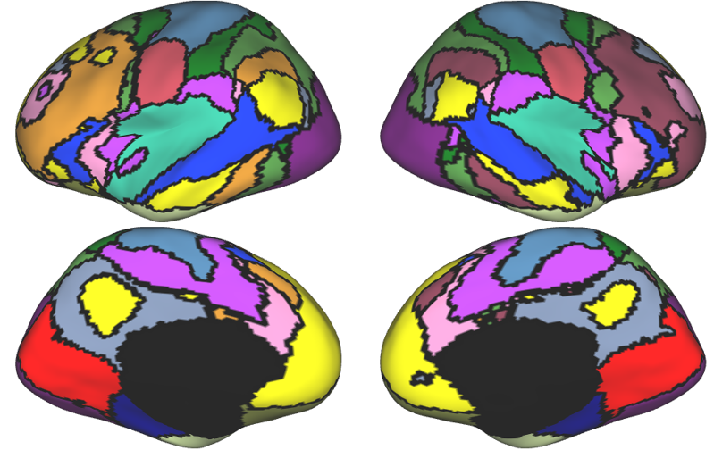
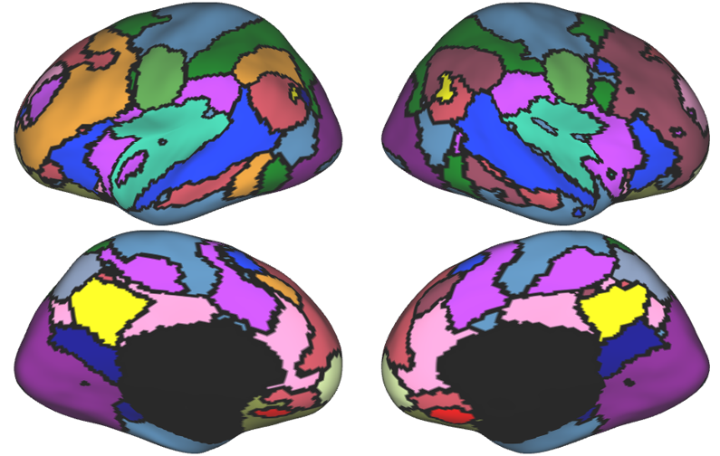
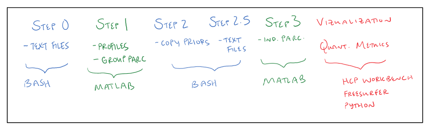

Kong2019 Parcellation Overview
==============================

Purpose
*******

The Kong 2019 Multi-session Hierarchical Bayesian Modeling pipeline allows users to take functional MRI BOLD runs and create individualized network parcellations. This just means taking a brain surface and assigning network labels to each vertex, or splitting up the surface of the brain into functional brain networks. These networks include visual networks, somatomotor networks, an auditory network, dorsal and ventral attention networks, frontoparietal control networks, and others. These canonical networks are referred to extensively throughout the rs-fMRI literature. 

This tutorial will walk the user through the steps needed to create both group and individual parcellations using this unique pipeline. 

Parcellation Approaches
***********************

The Kong2019 MS-HBM pipeline isn't the only parcellation pipeline out there. Other parcellation approaches include k-means parcellations and seed-based approaches. However, unlike these alterantives, the Kong2019 pipeline takes group priors into account. These priors constrain the model in different ways--such as by dictating the spatial layout of the networks. In an update, the Kong2022 Areal MS-HBM pipeline includes additional priors not included in the Kong2019 pipeline, such as a gradient prior and a contiguity prior. 

`Below` is an example of Kong2019 parcellaton output.

`Below` is a comparative example of k-means parcellation output. 

Workflow Overview
*****************

The implementation of this pipeline includes both preparatory and processing steps. Preparatory steps include create text files and copying over group priors, while processing steps take the text files generated in the preparatory steps and perform specific calculations. The pipeline itself is organized into 3 steps, but we have expanded those here to include the preparatory steps and some post-processing.

* Step 0. Preparatory step that generates text files for Step 1.
* Step 1. Processing step that generates surface profiles for each individual and the group. Group parcellation can also be generated at this step if desired.
* Step 2. Preparatory step that involves copying over HCP group priors (access provided by CBIG).
* Step 3. Preparatory and processing step that generates text files and computes individual parcellations. 
* Step 4. Processing step for visualizing group and individual parcellations. 
* Step 5. Processing step for computing quantitative metrics on parcellation output. 

.. note:: We will assume that the reader is not interested in generating their own group priors for this tutorial. Instead, we will use priors previously released by CBIG. However, if this is the case, we will include a page at the very end titled "Training Your Own Priors" detailing how this is different and what steps to take. 

`Below` is an illustrated version of the parcellation steps. 

Prerequisite Processing
***********************

Before embarking on this journey, please note that the following preprocessing steps should be completed. 

* BIDS organization of raw data
* Freesurfer recon-all output within BIDS formatted raw data.
* CBIG2016 preprocessing output (requires the above) for each participant. 

Prerequisite Software
*********************

* CBIG Github repo (see https://neurodocs.readthedocs.io/en/latest/cprep/cprep_0.html for details)
* MATLAB (version r2018b preferred)
* HCP Workbench (see https://humanconnectome.org/software/get-connectome-workbench). This is a download and unzip kind of installation.
* Freesurfer 
* Python v3.6 (quantitative analysis only)

Additional Resources
********************

* CBIG Github repo (https://github.com/ThomasYeoLab/CBIG/tree/master/stable_projects/brain_parcellation/Kong2019_MSHBM). For more techinical details and a replication example (to verify your pipeline will compute the same results).
* CBIG Google group (https://groups.google.com/forum/#!forum/cbig_users/join). For updates and bugs.
