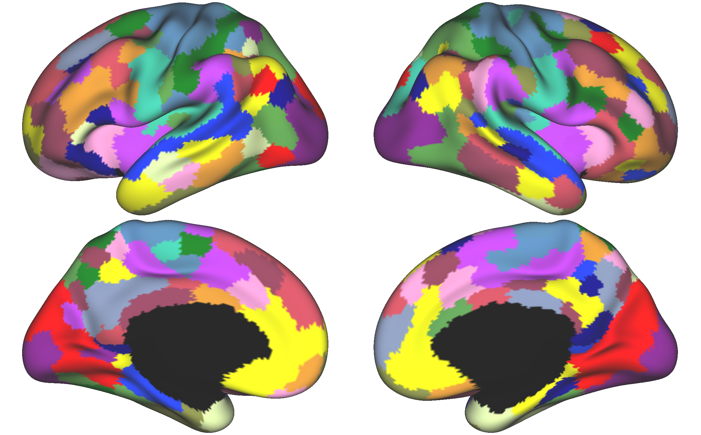
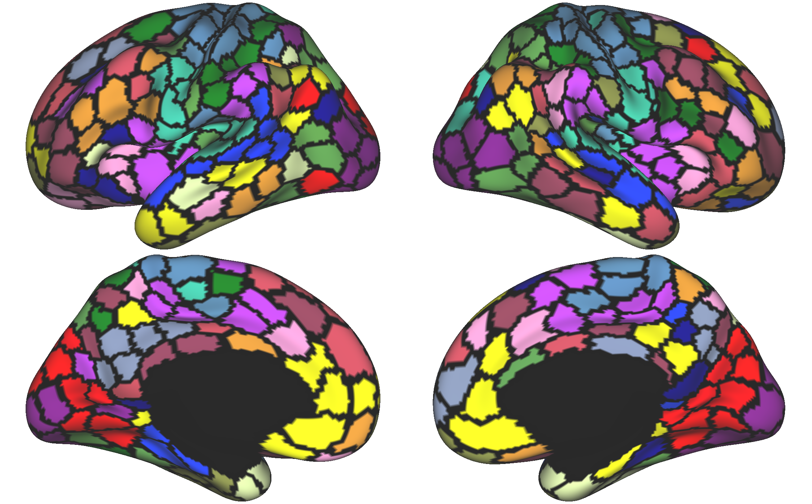

Kong2022 Step 4: Hungarian Matching and Visualization
=====================================================

Step 4 Overview
***************

Once you have generated the individual parcellations, a few steps remain before you can visualize the output. These include Hungarian matching (particularly if you generated your own priors and desire to use the same labels as previously published research), parc2annot, annot2gii, and then visualization in Workbench. 

.. note:: The following scripts were implemented on a group parcellation, but can be adapted to individual parcellations using a simple for loop.

Hungarian Matching 
******************

Hungarian matching is important if you desire to maintain continuity in labels between publications and datasets. 

First, we must generate the reference .mat file to match our individual parcellations to. This can be accomplished by taking the Schaefer2018 group parcellation (17N, 400 parcels, fsaverage6 resolution) and converting the annotation file to a .mat file.

.. code-block:: matlab 
        
        %Purpose: Convert freesurfer fs6 17 network .annot file to .mat labels for use as a reference in Hungarian matching algorithm.
        %Inputs: 17Network .annot file (found in $CBIG_CODE_DIR)
        %Outputs: .mat file containing rh_labels and lh_labels in fsaverage6
        %resolution

        %To run: 1. Open Matlab using salloc (ex: `salloc --mem-per-cpu 6G --time 2:00:00 --x11`)
        %	 2. source your config file containing the $CBIG_CODE_DIR variable
        %	 3. `cd` to the $CBIG_CODE_DIR/stable_projects/brain_parcellation/Kong2019_MSHBM/step3... folder
        % 	 4. `cp` this script over to the step3 folder in the CBIG repo
        %	 5. Enter the command `ml matlab/r2018b`
        %	 6. Enter the command `LD_PRELOAD= matlab`
        %	 7. In Matlab: Pull up this script and choose "Run" (green button)
        %	

        % Written by M. Peterson, Nielsen Brain and Behavior Lab under MIT License 2022.

        %Set paths
        annot_dir='/fslgroup/fslg_rdoc/compute/CBIG/stable_projects/brain_parcellation/Schaefer2018_LocalGlobal/Parcellations/FreeSurfer5.3/fsaverage6/label';
        out_dir='/fslgroup/fslg_spec_networks/compute/results/fsaverage_surfaces';

        %Load in .annot file
        rh_annot_file=fullfile(annot_dir,'rh.Schaefer2018_400Parcels_17Networks_order.annot');
        lh_annot_file=fullfile(annot_dir,'lh.Schaefer2018_400Parcels_17Networks_order.annot');
        [v, rh_labels, ct] = read_annotation(rh_annot_file);
        rh_colist=ct.table(:,5)';
        [v, lh_labels, ct] = read_annotation(lh_annot_file);
        lh_colist=ct.table(:,5)';

        %Convert labels to 1-17 label (based on color LUT table in these .annot
        %files and the group.colors struct)
        count = 0;
        for col = rh_colist      
            rh_labels(rh_labels==col)=count;
            count = (count+1);
        end 

        count=0;
        for col= lh_colist
            lh_labels(lh_labels==col)=count;
            count = (count+1);
        end

        %Write out labels
        out_name = fullfile(out_dir, '400Parcel_Yeo17Network_Reference_FS6_Labels_220927.mat');
        save(char(out_name), 'lh_labels', 'rh_labels');

        %Draw parc & visually verify
        CBIG_DrawSurfaceMaps(lh_labels, rh_labels, 'fsaverage6', 'inflated',0,201,ct.table(:,1:3));

.. note:: The reference file for matching only needs to be generated once. 

Next, we can go ahead and implement the matching algorithm on our newly generated parcellations.

.. code-block:: matlab 

    %Purpose: Implement Hungarian Matching Algorithm for MSHBM and k-means parcellations 
    %parcellations.
    %Inputs: MSHBM and k-means parcellations (run directly following
    %parcellation BEFORE visualization)
    %Outputs: Individual parcellations with matched values (e.g., network 1 is the same across parcellation methods. 
    %
    %To run: 1. Open Matlab using salloc (ex: `salloc --mem-per-cpu 6G --time 2:00:00 --x11`)
    %	 2. source your config file containing the $CBIG_CODE_DIR variable
    %	 3. `cd` to the $CBIG_CODE_DIR/stable_projects/brain_parcellation/Kong2019_MSHBM/step3... folder
    % 	 4. `cp` this script over to the step3 folder in the CBIG repo
    %	 5. Enter the command `ml matlab/r2018b`
    %	 6. Enter the command `LD_PRELOAD= matlab`
    %	 7. In Matlab: Pull up this script and choose "Run" (green button)
    %	
    % Written by M. Peterson, Nielsen Brain and Behavior Lab under MIT License
    % 2022.

    %% Set paths and variables
        %mshbm project_dir
        project_dir_m = '/fslgroup/grp_hcp/compute/HCP_analysis/Kong2022_parc_output_fs6_HCP_ALL/generate_profiles_and_ini_params/group';

    %% HCP ALL Runs
        %load MSHBM parcellations
        sub_filename = "group.mat";
        input_file = fullfile(project_dir_m,sub_filename);
        input_labels=load(input_file);
        
        %Adjust RH labels before matching
        input_labels.rh_labels=input_labels.rh_labels-200;
        input_labels.rh_labels(input_labels.rh_labels==-200)=0;
        lh_labels=input_labels.lh_labels;
        rh_labels=input_labels.rh_labels;
        save(char(input_file), 'lh_labels', 'rh_labels');
        
        %load reference
        ref_file = '/fslgroup/fslg_spec_networks/compute/results/fsaverage_surfaces/400Parcel_Yeo17Network_Reference_FS6_Labels_220927.mat';
        ref_labels=load(ref_file);
        
        %output file name
        output_file = fullfile(project_dir_m, 'group_matched.mat');
        
        % Implement CBIG Hungarian Cluster Match Surf Wrapper Script
        CBIG_HungarianClusterMatchSurfWrapper(ref_file, input_file, output_file);

Parcellation to Annotation File 
********************************

Next, we will use a CBIG function in MATLAB to convert the .mat individual parcellations into annotation files. 

.. code-block:: matlab 

        % Wrapper script to turn parcellation files into FreeSurfer annotation
        % files. 
        %
        % Assumes ind_parcellation output from Kong2019 CBIG pipeline.
        % Written by M. Peterson, Nielsen Brain and Behavior Lab

        %To run: 
        %	 1. Claim computing resources using salloc (ex: `salloc --mem-per-cpu 6G --time 2:00:00 --x11`)
        %    2. Source your CBIG config file to set up CBIG environment.	 
        %    3. Load matlab module: `ml matlab/r2018b`
        %	 4. Enter the command `LD_PRELOAD= matlab`

        %% HCP ALL
        project_dir = '/fslgroup/grp_hcp/compute/HCP_analysis/Kong2022_parc_output_fs6_HCP_ALL/generate_profiles_and_ini_params/group';
        out_dir = '/fslgroup/grp_hcp/compute/HCP_analysis/Kong2022_parc_output_fs6_HCP_ALL/quant_metrics/MSHBM_GROUP_vis';

        if(~exist(out_dir))
                mkdir(out_dir);
        end

        group_filename = 'group_matched.mat';
        file = fullfile(project_dir,group_filename);
        lh_name = strcat('sub-GROUP','_Kong2022_lh.annot');
        rh_name = strcat('sub-GROUP','_Kong2022_rh.annot');
        lh_output_file = fullfile(out_dir,lh_name);
        rh_output_file = fullfile(out_dir,rh_name);
        CBIG_SaveParcellationToFreesurferAnnotation(file, lh_output_file, rh_output_file);

.. note:: Resources for this step, including an edited version of the CBIG function CBIG_SaveParcellationToFreesurferAnnotation as well as correct reference colors are available on GitHub: https://github.com/peter3200/NeuroDocs/tree/main/example_data/parc2annot.

Annotation to GIFTI File 
************************

Once the parcellation is in the FreeSurfer annotation file format, we can readily convert it to GIFTI format for visualization. This will be implemented in bash using the FreeSurfer functions mri_surf2surf and mris_convert. The output will be in fsaverage6 resolution.

.. code-block:: bash 

    #!/bin/bash

    #Purpose: Create label files in fs6 space - from GROUP parcellation files
    #Inputs: parc2annot annotation files
    #Outputs: .label.gii parcellation files
    #Written by M. Peterson, Nielsen Brain and Behavior Lab under MIT License 2022

    #SET PATHS
    OUTDIR=/fslgroup/grp_hcp/compute/HCP_analysis/Kong2022_parc_output_fs6_HCP_ALL/quant_metrics/MSHBM_GROUP_vis

    #Create .label.gii parcellation files
    for SUB in GROUP; do
        #Resample LH annot
        mri_surf2surf --srcsubject fsaverage --sval-annot ${OUTDIR}/sub-${SUB}_Kong2022_lh.annot --trgsubject fsaverage6 --hemi lh --trgsurfval ${OUTDIR}/sub-${SUB}_fs6_lh --trg_type annot
        #Resample RH annot
        mri_surf2surf --srcsubject fsaverage --sval-annot ${OUTDIR}/sub-${SUB}_Kong2022_rh.annot --trgsubject fsaverage6 --hemi rh --trgsurfval ${OUTDIR}/sub-${SUB}_fs6_rh --trg_type annot

        #LH label file
        mris_convert --annot ${OUTDIR}/sub-${SUB}_fs6_lh.annot ${FREESURFER_HOME}/subjects/fsaverage6/surf/lh.white ${OUTDIR}/sub-${SUB}_lh.label.gii
        #RH label file
        mris_convert --annot ${OUTDIR}/sub-${SUB}_fs6_rh.annot ${FREESURFER_HOME}/subjects/fsaverage6/surf/rh.white ${OUTDIR}/sub-${SUB}_rh.label.gii
    done

HCP Workbench Visualization 
***************************

The GIFTI parcellations are simple to load in HCP Workbench. First, load your surface underlays (fsaverage6 surface files are available on GitHub https://github.com/peter3200/NeuroDocs/tree/main/example_data). Next, load your GIFTI parcellation files.

Parcellations may be displayed with and without parcel outlines. 

.. note:: Prior scripts used to calculate network surface area for the Kong2019 parcellation can be adapted for use with this parcellation. Note, however, that each parcel is given its own label (1-200 LH and RH) rather than a network label (1-17). 
