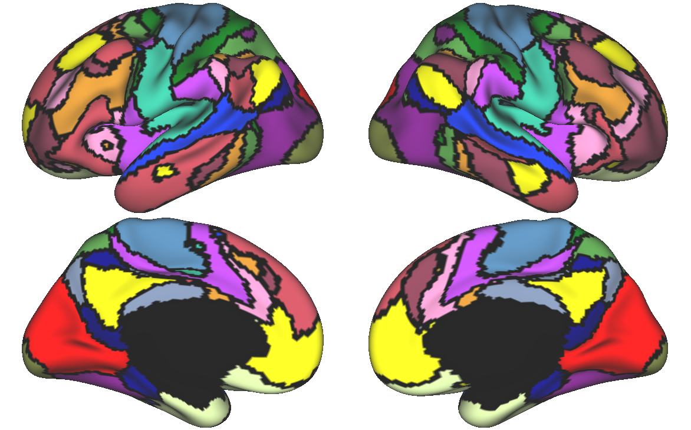
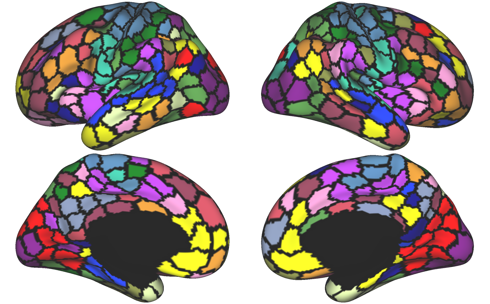

Kong2022 Parcellation Overview
==============================

Overview
********
This areal-level MS-HBM pipeline is designed to generate parcellations for individuals with multiple sessions of rs-fMRI data. As an overview, this model uses a variational Bayes expectation maximization algorithm to estimate the following paramters: group-level parcel connectivity profiles, inter-subject functional connectivity variability, intra-subject functional connectivity variability, a spatial smoothness prior, and an inter-subject spatial variability prior. Beyond these parameters, three additional priors are available for inclusion in the model (all three are recommended as per Kong et al., 2021). These priors are as follows: a spatial localization prior constraining each individual-specific parcel to be within 30 mm of the group-level parcellation boundaries (derived from the 400-parcel Schaefer 2018 group parcellation), a contiguity prior encouraging vertices comprising a parcel to be near to the parcel center, and a gradient prior which encourages adjacent brain areas with gradual changes in functional connectivity to be grouped into the same parcel. In comparison with the distributed (dMS-HBM) and contiguous (cMS-HBM) model variants, the gMS-HBM variant was found to be the most anatomically plausible, had fewer spatially disconnected components than dMS-HBM, intermediate levels of parcel roundness between dMS-HBM and cMS-HBM, and the best behavioral prediction performance when the resulting parcellation data were included in a kernel ridge regression model (Kong et al., 2021). 

While both the Kong et al. 2019 MS-HBM and 2021 areal MS-HBM parcellation pipelines utilize a variational Bayes expectation-maximization algorithm to best generate individual parcellations, the resulting parcellations and algorithms differ in a few key ways. First, the areal MS-HBM pipeline includes three additional priors not included in the 2019 version. Additionally, the 2021 version incorporates the 2018 Schaefer parcellation as part of spatial localization prior, resulting in potentially more parcels of smaller sizes. However, the 2021 version does require more time and computational power (used to estimate the individual gradients as part of the gradient prior). See the following group parcellations for a visual comparison (N=232 HCP subjects).

Kong et al. 2019 HCP Group Parcellation 

Kong et al. 2021 HCP Group Parcellation 

.. note:: As noted on the CBIG documentation, the paper describing the areal-level MS-HBM pipeline was published earlier than expected (2021), so while the repo names the pipeline "Kong2022", the publication year was 2021. These years may be used interchangably in the present documentation.

Prerequisite Software
*********************

* CBIG Github repo (see https://neurodocs.readthedocs.io/en/latest/cprep/cprep_0.html for details)

* MATLAB (version r2018b preferred)

* HCP Workbench (see https://humanconnectome.org/software/get-connectome-workbench). This is a download and unzip kind of installation.

* Freesurfer

Prerequisite Preprocessing
**************************

It is assumed that the following steps have been completed prior to beginning this pipeline.

* BIDS organization of raw data

* Freesurfer surface reconstruction within the BIDS-formatted raw data structure

* CBIG2016 preprocessing output (requires the above) for each participant. This could be substituted for preprocessing completed by a different pipeline (such as fMRIprep) followed by surface projection of the preprocessed data.

Workflow Overview
*****************

This tutorial has been organized in the following steps. 
0. Generate gradients (for each individual)
1. Generate connectivity profiles (for each individual and the group if desired)
2. Copy over or generate group priors 
3. Generate individual parcellations
4. Hungarian matching and HCP Workbench visualization

Additional Resources
********************

* CBIG GitHub repo (https://github.com/ThomasYeoLab/CBIG/tree/master/stable_projects/brain_parcellation/Kong2022_ArealMSHBM). For more techinical details and a replication example (to verify your pipeline will compute the same results).

* CBIG Google group (https://groups.google.com/forum/#!forum/cbig_users/join). For updates and bugs.
