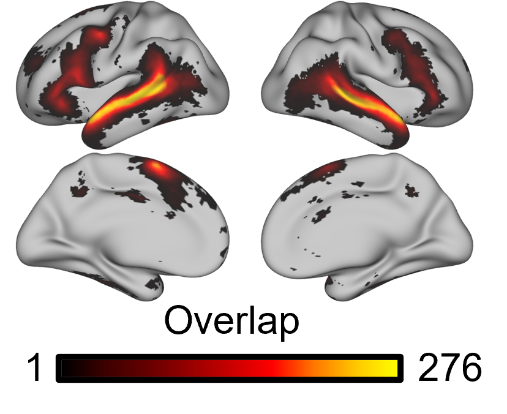

Overlap Map Figure
==================

Overview
********

Hypothetically, if you have generated network parcellations and you are interested in identifying the probability that a given vertex has been assigned a specific network label across a group of participants, how might you visually display these data? If you want to maintain the idiosyncrasies inherent to individual parcellations, then simply displaying a group parcellation is sub-optimal. However, a simple yet visually compelling solution is to display the overlap across subjects for a given network. This visual display is common in neuroimaging papers displaying network parcellations (for a recent example, see `Du et al. (2024) Figure 14 <https://journals.physiology.org/doi/abs/10.1152/jn.00308.2023>`_). 

The following two scripts have been developed to first calculate the network overlap for 17 networks (although they could easily be edited for any number of networks), and next play those data within a surface file framework (namely, GIFTI files). From here, the user could easily display these GIFTI files overlaid on an fsaverage6 midthickness surface template in HCP Workbench. 

For a use case (and to download the scripts), please see `GitHub <https://github.com/Nielsen-Brain-and-Behavior-Lab/NSAR2023/tree/main/ind_parc/network_overlap_fig/HCP>`_. 

Step 1 Generate Network Overlap
*******************************

This first step, where we are calculating the network overlap for individual parcellations, is optimized for MATLAB r2018b. 

This script will require the following Inputs

- Hungarian-matched .mat individual parcellation files 
- A subject IDs text file 
- An output directory that will be referenced in Step 2

File name: step1_generate_network_overlap.m

.. code-block:: matlab 

    % Purpose: Calculate network overlap for each MS-HBM network
    % Inputs: Hungarian-matched individual network parcellations
    % Outputs: rh_labels and lh_labels containing overlap values for
    % each network
    %
    % Written by M. Peterson, Nielsen Brain and Behavior Lab, under MIT License
    % 2024

    % To run: 
    %	 1. Claim computing resources using salloc (ex: `salloc --mem-per-cpu 30G --time 48:00:00 --x11`)
    %	 2. Load matlab module: `ml matlab/r2018b`
    %	 3. Enter the command `LD_PRELOAD= matlab`
    %%

    %GROUP
    group = 'HCP_DISC'; 

    % Set paths
    project_dir = '/fslgroup/grp_hcp/compute/HCP_analysis/DISC_AND_REP/ind_parcellation';  %Input folder for Hungarian-matched individual parcellations
    out_dir = strcat('/fslgroup/grp_hcp/compute/HCP_analysis/DISC_AND_REP/network_overlap_output/', group); %This is the same in Step 2

    %HCP- DISC (Load subject IDS text file)
    filename = '/fslgroup/fslg_spec_networks/compute/code/HCP_analysis/network_overlap_fig/hcp_disc/study3_HCPDISC_IDS_230911.txt'; 
    delimiter = {''};
    formatSpec = '%s%[^\n\r]';
    fileID = fopen(filename,'r');
    dataArray = textscan(fileID, formatSpec, 'Delimiter', delimiter, 'TextType', 'string',  'ReturnOnError', false);
    fclose(fileID);
    subjids = [dataArray{1:end-1}];
    clearvars filename delimiter formatSpec fileID dataArray ans;

    % Loop through each network
    for network = 1:17  %specify number of networks
        % Initialize vectors to store aggregated labels for each network
        overlap_lh_labels = zeros(40962, 1); %vector size is based on the number of LH or RH vertices in fsaverage6 space
        overlap_rh_labels = zeros(40962, 1);
        
        
        %Loop through each subject in group list
        for i = 1:length(subjids)
        sub=subjids(i);    

        %load individual parc
        parc_file = strcat('Ind_parcellation_MSHBM_sub', sub, '_w200_MRF30_matched.mat');  %File name for individual parcellation
        parc_full = fullfile(project_dir, parc_file);
        load(parc_full)
    
            
        % Set all elements in the vector to 0 except those that match network
        lh_labels(lh_labels ~= network) = 0;
        rh_labels(rh_labels ~= network) = 0;
        
        % Turn just the elements that match network N to 1 
        lh_labels(lh_labels == network) = 1;
        rh_labels(rh_labels == network) =1;
    
        % Update aggregated labels for network N (so if S subjects have network N on vertex X, X will have the value of S)
        overlap_lh_labels = overlap_lh_labels + lh_labels;
        overlap_rh_labels = overlap_rh_labels + rh_labels;

        %Clear out variable that changes on a subject basis
        clear rh_labels;
        clear lh_labels;
        
        end

        
    %write overlap output as overlap_rh_labels and overlap_lh_labels in a .mat file
        if(~exist(out_dir))
            mkdir(out_dir);
        end
        
    save(fullfile(out_dir, strcat(group, '_NETWORK_', num2str(network), '_FS6_OVERLAP.mat')), 'overlap_lh_labels','overlap_rh_labels');

    end

Step 2 Convert Overlap to GIFTI 
*******************************

For Step 2, we will take the .mat output from Step 1 and convert it into GIFTI file format, so it can be visualized in HCP Workbench. 

Required inputs for this step include

- .mat files from Step 1 containing overlap_lh_labels and overlap_rh_labels
- GIFTI shape template files (downloadable from GitHub; `LH Shape File <https://github.com/peter3200/NeuroDocs/blob/main/example_data/FS6_lh.shape.gii>`_ and `RH Shape File <https://github.com/peter3200/NeuroDocs/blob/main/example_data/FS6_rh.shape.gii>`_).

File name: step2_overlap2gii.m

.. code-block:: matlab 

    % Purpose: Convert lh_labels and rh_labels to gifti shape files for later WB
    % visualization
    % Inputs: lh_labels and rh_labels from generate_network_overlap.m and template gifti
    % files in appropriate resolution. 
    % Outputs: .shape.gii files containing AI values.
    %
    % Note: Template .shape.gii files can be created using mris_vol2surf in
    % combination with bbregister. See the following script: project_surface_FS_AVG_FS6.sh
    %
    % Written by M. Peterson, Nielsen Brain and Behavior Lab, under MIT License 2022

    % To run: 
    %	 1. Claim computing resources using salloc (ex: `salloc --mem-per-cpu 20G --time 48:00:00 --x11`)
    %	 2. Load matlab module: `ml matlab/r2018b`
    %	 3. Enter the command `LD_PRELOAD= matlab`
    %%

    %GROUP
    group = 'HCP_DISC';

    % Set paths and variables
    out_dir = strcat('/fslgroup/grp_hcp/compute/HCP_analysis/DISC_AND_REP/network_overlap_output/', group); %This is the same as Step 1
    gifti_template_dir = '/fslgroup/fslg_spec_networks/compute/results/fsaverage_surfaces'; %Folder containing GIFTI template files (.shape.gii)

    % Loop through each network
    for network = 1:17
        
        %load overlap data
        infile = strcat(group, '_NETWORK_', num2str(network), '_FS6_OVERLAP.mat');
        inputfull = fullfile(out_dir, infile);
        if isfile(inputfull)
            load(inputfull)
        
            %grab resolution
            resolution = size(overlap_lh_labels,1);
            
            %output filenames
            fname_lh = strcat(group, '_NETWORK_', num2str(network), '_FS6_OVERLAP_lh.shape.gii');
            fname_rh = strcat(group, '_NETWORK_', num2str(network), '_FS6_OVERLAP_rh.shape.gii');
            full_lh = fullfile(out_dir, fname_lh);
            full_rh = fullfile(out_dir, fname_rh);
        
            %load in template .shape.gii file 
            g_left = gifti(fullfile(gifti_template_dir, 'FS6_lh.shape.gii'));
            g_right = gifti(fullfile(gifti_template_dir, 'FS6_rh.shape.gii'));
        
            %replace vertex values in templates with AI values
            metric = single(ones(resolution, 1));
            g_left.cdata = metric;
            g_right.cdata = metric;
            g_left.cdata = overlap_lh_labels;
            g_right.cdata = overlap_rh_labels;
        
            %save output
            save(g_left, char(full_lh));
            save(g_right, char(full_rh));
        else
        end
    end

Expected Outputs
****************

For networks N, you can expect N right hemisphere and N left hemisphere .shape.gii GIFTI files containing the network overlap data. 

From here, the next step is to visualize these GIFTI files in HCP Workbench. To do this will require overlaying our newly produced .shape.gii files over surface GIFTI files. These .surf.gii files can be downloaded from GitHub.

* `LH Inflated Surface Template <https://github.com/peter3200/NeuroDocs/blob/main/example_data/lh.pial_infl2.surf.gii>`_
* `RH Inflated Surface Template <https://github.com/peter3200/NeuroDocs/blob/main/example_data/rh.pial_infl2.surf.gii>`_

Here is an example of output produced using these scripts and HCP Workbench. This is an overlap map for a language network using a subset of HCP subjects (N=276).

    