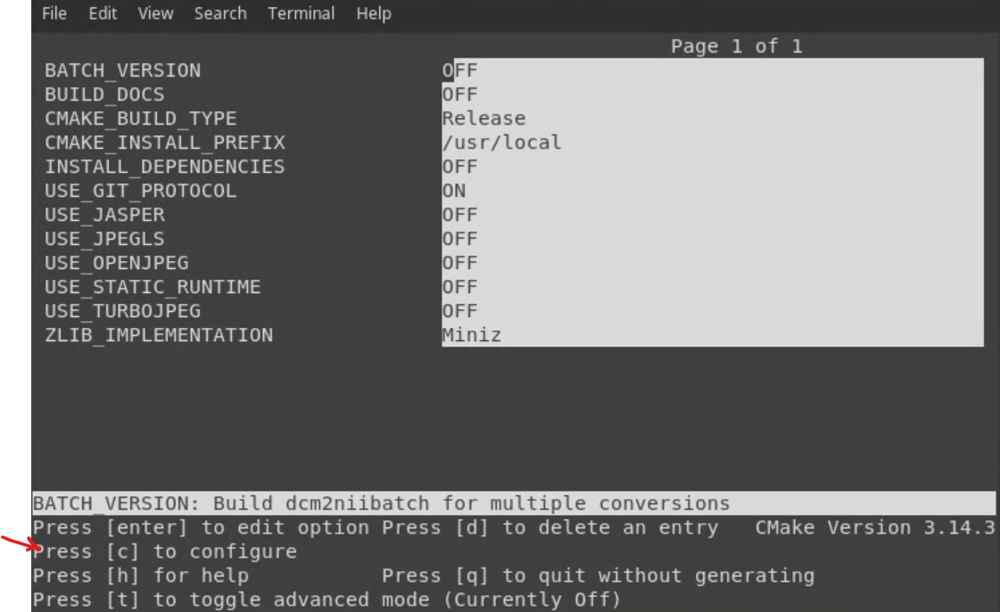
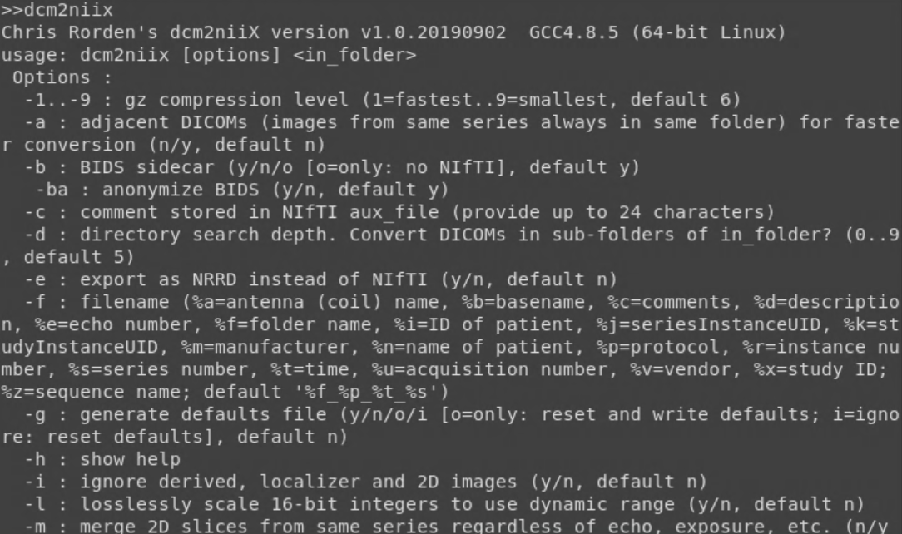
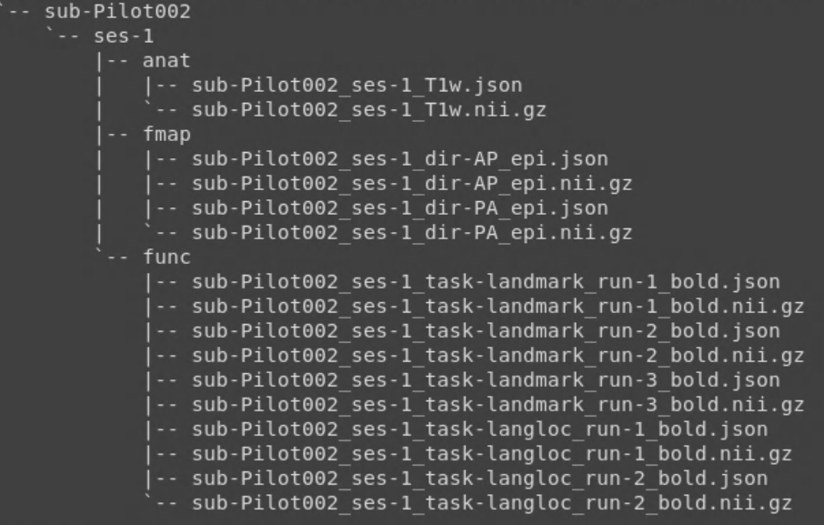

Preproc Step 1: Data Organization
=================================

For our first step of preprocessing, we are going to take our raw MRI files (dicoms) and turn these into a more usable format (NIFTI or .nii). From here, we will organize our data into the standardized BIDS format.

Installing dcm2niix
*******************

**Overview** 
Installing software on the supercomputer involves three basic steps: 1) getting the software, 2) configuring the software, and 3) updating the environment. This piece of software, dcm2niix, will take our raw dicoms and convert them into NIFTI files.

1. Create our software folder.

.. code-block:: console
    
    $ mkdir research_bin
    $ cd research_bin

2. Load modules.

.. code-block:: console
   
    $ module load cmake/3.14

3. Clone a copy of dcm2niix software from Github

.. code-block:: console

    $ git clone https://github.com/rordenlab/dcm2niix.git

4. Create a "build" directory

.. code-block:: console

    $ cd dcm2niix
    $ mkdir build && cd build

5. Configure dcm2niix for installation

.. code-block:: console

    $ ccmake ..

A screen will take over the terminal and show a list of options. Press "c" for configure.

6. From here, ccmake will attempt the configuration but throw an error. Press "e" to exit to an option screen.

7. Use the arrow keeys to navigate to USE_STATIC_RUNTIME and use "return" to toggle ON to OFF.

8. Now that USE_STATIC_RUNTIME is set to OFF, we can configure by pressing "c" multiple times until the option "generate" appears. Press "g" to generate and exit.

9. With the configuration complete, we can now install it. Do this by entering:

.. code-block:: console

    $ make

The installation is complete once you receive a 100% report: [100%] Built target console

10. The final step is to add the software to the environmental PATH by editing the ~/.bash_profile:

.. code-block:: console

    $ nano ~/.bash_profile

In the ~/.bash_profile, add the following path:

.. code-block:: bash

    # dcm2niix path
    PATH=${PATH}:\
    ~/research_bin/dcm2niix/build/bin 

Save your work and update the environment:

.. code-block:: console 

    $ source ~/.bash_profile 

11. Test the installation 

.. code-block:: console 

    $ dcm2niix 

Dicoms to NIFTIs
****************

Using dcm2niix is pretty straightforward! For example, we point it to an output directory, specify any special flags, and indicate a folder containing dicoms!

.. code-block:: console 

    $ ~/research_bin/dcm2niix/build/bin/dcm2niix -o ${OUTDIR}/anat/ -f t1 -x y ${INPUTDIR}

BIDS Formatting
***************

The Brain Imaging Data Structure (BIDS) is a convention for standardizing file structures and naming conventions for datasets. This makes it much easier to share data and navigate shared data! The formal documentation for BIDS can be found `online <https://bids-specification.readthedocs.io/en/stable/index.html>`__. BIDS formatting is required for fMRIprep, a preprocessing pipeline.

Using the ``tree`` command, we can view the file structure for a subject that is already in BIDS format:

A few things to note from this image:

* Subject-level directories are named "sub-XXXX"
* Within each subject's directory, there are sessions. If you only have one session per participant, then all of your imaging data will fall within "ses-1"
* Within each session, there are folders containing specific data types. For example, the "anat" folder contains structural images, such as T1w and T2w images. A "dti" folder will contain dti images, etc. 
* Files are named: sub-SUBJECT_ses-SES#_
* For functional files, particularly where there are multiple runs for each task, the task name and run number must be specified. 

.. note:: If you are unsure how to name your files, consult the `BIDS guide <https://bids-specification.readthedocs.io/en/stable/index.html>`__.

Going from Dicoms to BIDS 
*************************

Using some for loops, we can take our dicom files directly to BIDS-formatted NIFTI files! Job script is available for lab members on `Github <https://github.com/Nielsen-Brain-and-Behavior-Lab/AutismHemisphericSpecialization/blob/main/preproc/dcm2nii_job.sh>`__.

To do this for each subject simultaneously, we are going to use a job script and a wrapper script. The wrapper script can be thought of as an outer layer that submits a supercomputing job for each subject. 

1. Wrapper script: We first call on bash and set our paths. Then, we loop through each subject found in the subject directory and submit a job (as well as create output and error files for each job). 

.. code-block:: bash 

    #!/bin/bash

    code_dir=/fslgroup/fslg_spec_networks/compute/code/data_org
    log_dir=/fslgroup/fslg_spec_networks/compute/code/data_org/logfiles
    mkdir -p ${log_dir}
    subj_dir=/fslgroup/fslg_spec_networks/compute/data/data_dump

    for sub in `ls ${subj_dir}`; do
	    sbatch \
	    -o ${log_dir}/output_${sub}.txt \
	    -e ${log_dir}/error_${sub}.txt \
	    ${code_dir}/job_dcm2nii.sh ${sub}
	    sleep 1
    done

2. Job script: We first call on bash and setup our job information. Then, we are going to loop through each directory within each subject to find any dicoms and convert those to NIFTIs. The output will be in BIDS format.

.. code-block:: bash 

    #!/bin/bash

    #SBATCH --time=01:00:00   # walltime
    #SBATCH --ntasks=1   # number of processor cores (i.e. tasks)
    #SBATCH --nodes=1   # number of nodes
    #SBATCH --mem-per-cpu=30720M   # memory per CPU core
    #SBATCH -J "dcm2niix"   # job name

    # Set the max number of threads to use for programs using OpenMP. Should be <= ppn. Does nothing if the program doesn't use OpenMP.
    export OMP_NUM_THREADS=$SLURM_CPUS_ON_NODE

    # dcm2BIDS
    sub=${1}
    sub_dir=/fslgroup/fslg_spec_networks/compute/data/data_dump/${sub}/source_data

    number_ses=0
    for ses in `ls ${sub_dir}`; do 
	    number_ses=$((number_ses+1))
	
	    #Do not change these paths!
	    home_dir=/fslgroup/fslg_spec_networks/compute/data
	    cd ${home_dir}/data_dump/${sub}/source_data/${ses}
	    mv Research_Nielsen\ -\ 1/ Research_Nielsen
	    cd /fslgroup/fslg_spec_networks/compute/code/data_org
	    dicom_dir=${home_dir}/data_dump/${sub}/source_data/${ses}/Research_Nielsen
	    out_dir=${home_dir}/BIDS_compliant/sub-${sub}/ses-${number_ses}
	    mkdir -p ${out_dir}
	    anat_dir=${out_dir}/anat
	    func_dir=${out_dir}/func
	    fmap_dir=${out_dir}/fmap

	    #Set output string
	    name_string=sub-${sub}_ses-${number_ses}

	    #Make output directories
	    mkdir -p ${anat_dir} ${fmap_dir} ${func_dir}

	    #Remove unnecessary folders
	    rm -r ${dicom_dir}/PhoenixZIPReport*

	    #Construct T1 NIFTI files (08mm)
	    count=0
	    for i in `ls -d ${dicom_dir}/t1_mprage_Amish_08mm*`; do
		count=$((count+1))
		dcm2niix -b y -ba y -z y -w 0 -o ${anat_dir} -f ${name_string}_T1w ${i}/	
	    done

	    #Construct T2 NIFTI files
	    count=0
	    for i in `ls -d {dicom_dir}/t2*`; do
		count=$((count+1))
		dcm2niix -b y -ba y-z y -o ${anat_dir} -f ${name_string}_T2w ${i}/
	    done

	    #Construct Inscapes
	    count=0
	    for i in `ls -d ${dicom_dir}/Inscapes*`; do
		count=$((count+1))
		dcm2niix -b y -ba y -z y -o ${func_dir} -f ${name_string}_task-inscapes_run-${count}_bold ${i}/
	    done

	    #Construct LangLoc
	    count=0
	    for i in `ls -d ${dicom_dir}/LangLoc*`; do
		    count=$((count+1))
		    dcm2niix -b y -ba y -z y -o ${func_dir} -f ${name_string}_task-langloc_run-${count}_bold ${i}/
	    done

	    #Construct Landmark
	    count=0
	    for i in `ls -d ${dicom_dir}/LineTask*`; do
		    count=$((count+1))
		    dcm2niix -b y -ba y -z y -o ${func_dir} -f ${name_string}_task-landmark_run-${count}_bold ${i}/
	    done

	    #Construct Fieldmap - ap
	    dcm2niix -b y -ba y -z y -o ${fmap_dir} -f ${name_string}_dir-AP_epi ${dicom_dir}/mbep2d_spinecho_fieldmap_ap*/

	    #Construct Fieldmap - pa
	    dcm2niix -b y -ba y -z y -o ${fmap_dir} -f ${name_string}_dir-PA_epi ${dicom_dir}/mbep2d_spinecho_fieldmap_pa*/

	    #Construct Localizers
	    #dcm2niix -b y -ba y -z y -o ${anat_dir} -f ${name_string}_localizer ${dicom_dir}/Localizers_1/

    done

.. note:: There is an alternative to this particular scripting approach: `dcm2bids <https://pypi.org/project/dcm2bids>`__. This python project is designed to reorganize NIFTI files from dcm2niix into BIDS format. 
