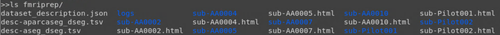
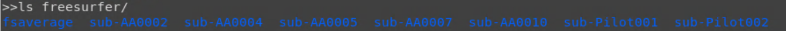

Preproc Step 2: fMRIprep
========================

The automated preprocessing pipeline fMRIprep includes both structural and functional processing components. For an overview, we recommend that you visit the `documentation <https://fmriprep.org/en/stable/>`__.

Installing fMRIprep
*******************

The installation of fMRIprep on the supercomputer is fairly simple. We will be using a docker container version of fMRIprep, so we won't need to configure and build the software like we did with dcm2niix. However, we will need to transfer the container from Box to the supercomputer as well as a several templates.

1. Install Rclone. Rclone allows us to move files and directories to and from cloud storage. Follow the instructions listed on the Office of Research Computing `website <https://rc.byu.edu/wiki/?id=Rclone>`__. If you run into any issues, don't hesitate to open a support ticket! 

Rclone is very useful for transferring files and backing them up, but if you need a quick alternative, you can download any files from Box to your local computer and use the ``scp`` command to transfer them to your supercomputing account (instructions `here <https://rc.byu.edu/wiki/?id=Transferring+Files>`__).

2. Copy the container folder from Box to the supercomputer. 

.. code-block:: console

    $ cd research_bin
    $ ml rclone #load rclone
    $ rclone copy Box:/Lab_Tutorials/fMRIprep_tutorial/fmriprep_container ./

3. Initialize fMRIprep

.. code-block:: console

    $ cd fmriprep_container
    $ ./fmriprep 

Template Download Error
***********************

Error 
~~~~~

When using fMRIprep, you may receive an error such as the following: 

"Downloading https://templateflow.s3.amazonaws.com/tpl-MNI152NLin6Asym/tpl-MNI152NLin6Asym_res-02_atlas-HCP_dseg.nii.gz
Sentry is attempting to send 0 pending error messages
Waiting up to 2 seconds
Press Ctrl-C to quit"

Explanation: During a job, fMRIprep cannot access the internet and download any needed templates from TemplateFlow, so it throws this error.

Solution
~~~~~~~~

1. Identify which templates are missing. 

Check ``$TEMPLATEFLOW_HOME`` which is usually in ``~/.cache``.  

.. code-block:: console

    $ cd .cache/templateflow 
    $ cd tpl-MNI152NLin6Asym #the folder with the missing template(s) indicated in the error message
    $ ls -l #check if the templates are empty (will show up as zeroes in the column to the right of your netid instead of random numbers)

2. Download a single missing template

.. code-block:: console

    $ cd tpl-MNI152NLin6Asym
    $ wget "https://templateflow.s3.amazonaws.com/tpl-MNI152NLin6Asym/tpl-MNI152NLin6Asym_res-02_atlas-HCP_dseg.nii.gz" 
    $ mv tpl-MNI152NLin6Asym_res-02_atlas-HCP_dseg.nii.gz.1 tpl-MNI152NLin6Asym_res-02_atlas-HCP_dseg.nii.gz #This step will replace the empty template with the newly downloaded one

3. Download multiple templates (if you notice that all of the templates in the folder are empty)

All of the templates for the following folder have been uploaded to Box: tpl-MNI152NLin6Asym. We will copy these files to templateflow. 

.. code-block:: console 

    $ cd ..
    $ rm -r tpl-MNI152NLin6Asym #delete the folder containing empty files 
    $ ml rclone 
    $ rclone copy box:/Lab_Tutorials/fMRIprep_tutorial/fmriprep_troubleshooting/templateflow/tpl-MNI152NLin6Asym ./
    $ cd tpl-MNI152NLin6Asym #check the download
    $ ls -l #you should see random number values in the column that follows your netid (if you see zeroes, you've still got empty templates)

Calling fMRIprep
****************

.. code-block:: bash 

    #Set variables
    SUB=sub-Pilot002
    RESULTS_DIR=/fslgroup/fslg_spec_networks/compute/results/fmriprep_native

    #Make the results folder
    mkdir -p ${RESULTS_DIR}

    #Call fMRIprep
    /fslgroup/fslg_spec_networks/compute/research_bin/fmriprep/fmriprep /fslgroup/fslg_spec_networks/compute/data/BIDS_compliant/${SUB} ${RESULTS_DIR} participant --fs-license-file /fslgroup/fslg_spec_networks/compute/research_bin/freesurfer/license.txt --skip-bids-validation --cifti-output 91k --output-space fsnative

#Explanation of arguments

#1. Full pathway to setup script for fmriprep package

#2. Full pathway to subject folder in BIDs-compliant format. Change subject to relevant subject.

#3. Full pathway to output folder

#4. Full pathway to freesurfer license text file

#5. Skip BIDS validation process (assuming data structure is not perfectly BIDs compliant)

#6. Provide CIFTI output (input for workbench connectivity maps)

#7. Output in fsnative space (warning: this will not output any nifti files for the functional runs; remove this flag and the output will default to MNI space)

This will need to run within a job script and the following parameters for optimal results:

.. code-block:: bash 

    #SBATCH --time=72:00:00	 #walltime 160:00:00 for 4 sessions
    #SBATCH --ntasks=4 	#number of processor cores
    #SBATCH --mem-per-cpu=150G 	#memory per CPU core 81920
    #SBATCH -J 'fmriprep' 	#job name

fMRIprep Output
***************

There are two main components of the fMRIprep output: fmriprep and freesurfer.

Within the fmriprep folder:

The fMRIprep results are organized in BIDS format: within each subject folder are session folders and within each session are the anat/ and func/ folders. 

Within the freesurfer folder are the standard recon-all outputs:

