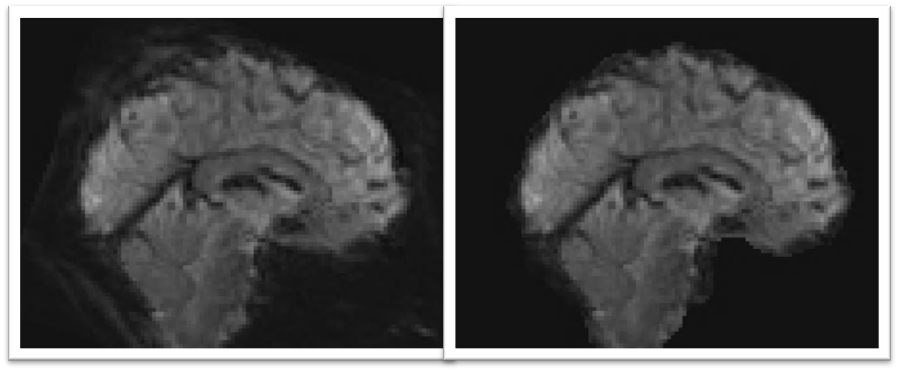
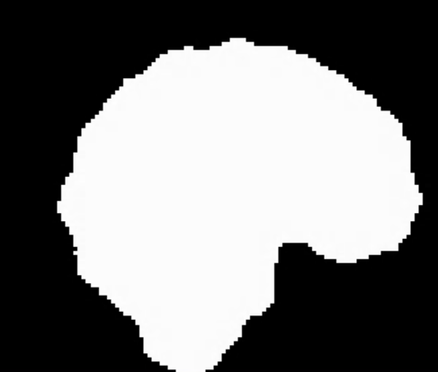
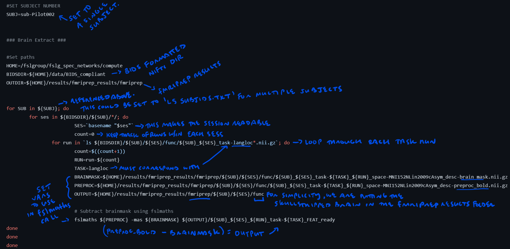

Preproc Step 3: Brain Extraction
================================

Overview
********

Now that fMRIprep preprocessing is complete, there is one more step before we can use the images in our task analysis: skullstripping. The ``*preproc_bold.nii.gz`` files appear to contain the skull, which we will want to remove. This is because we do not want our task analysis to identify voxels containing skull, meninges, or extra-axial CSF as being "active" during the task.

*Above:* Before (left) and after (right) skullstripping.  

Installing FSL
**************

To perform skullstripping and our task analysis, we will be using FSL, which contains a suite of neuroimaging tools. 

1. Fill out the form on the FSL download `website <https://fsl.fmrib.ox.ac.uk/fsldownloads_registration>`__. Be sure to select "Linux-Centos 7" as the operating system.

2. Click on the link to download ``fslinstaller.py`` which is the isntaller script. 

3. Send the FSL installer script to your supercomputing account:

.. code-block:: console

    $ cd Downloads
    $ scp fslinstaller.py NETID@ssh.rc.byu.edu:/fslhome/NETID/research_bin

4. Run the installer script on your supercomputing account.

.. code-block:: console 

    $ cd research_bin
    $ ml python/2.7 #load python version 2.7 
    $ python fslinstaller.py #to run any python script, the command is ``python script.py``

5. You will be asked to choose an installation location. Type the absolute path to the research_bin and the new directory that will be created:

.. code-block:: console 

    $ /fslhome/NETID/research_bin/FSL 

The script will then begin downloading and installing FSL. This will take ~30 minutes.

6. Verify download. To check if the download was successful, enter the following commands:

.. code-block:: console 

    $ $FSLDIR #this should point somewhere
    $ flirt-version #this should print something out

fslmaths
********

With FSL successfully installed, we are now ready to perform our brain extraction! We will be using fslmaths to subtract the brainmask from the preprocessing preproc_bold.nii.gz image. The brainmask comes from the fMRIprep output and will look something like the following: 

Scripting
~~~~~~~~~

Here is the script:

.. code-block:: bash 

    #!/bin/bash

    #Purpose: Create the brain extracted bold image 
    #Inputs: fMRIprep output
    #Outputs: Brain extracted bold image
    #Written by M. Peterson, Nielsen Brain and Behavior Lab under MIT License 2022

    #SET SUBJECT NUMBER
    SUBJ=sub-Pilot002

    ### Brain Extract ###

    #Set paths
    HOME=/fslgroup/fslg_spec_networks/compute
    BIDSDIR=${HOME}/data/BIDS_compliant
    OUTDIR=${HOME}/results/fmriprep_results/fmriprep

    for SUB in ${SUBJ}; do
	for ses in ${BIDSDIR}/${SUB}/*/; do
			SES=`basename "$ses"`
			count=0	
		    for run in `ls ${BIDSDIR}/${SUB}/${SES}/func/${SUB}_${SES}_task-langloc*.nii.gz`; do
			    count=$((count+1))
			    RUN=run-${count}
			    TASK=langloc
			    BRAINMASK=${HOME}/results/fmriprep_results/fmriprep/${SUB}/${SES}/func/${SUB}_${SES}_task-${TASK}_${RUN}_space-MNI152NLin2009cAsym_desc-brain_mask.nii.gz
			    PREPROC=${HOME}/results/fmriprep_results/fmriprep/${SUB}/${SES}/func/${SUB}_${SES}_task-${TASK}_${RUN}_space-MNI152NLin2009cAsym_desc-preproc_bold.nii.gz
			    OUTPUT=${HOME}/results/fmriprep_results/fmriprep/${SUB}/${SES}/func

			    # Subtract brainmask using fslmaths
			    fslmaths ${PREPROC} -mas ${BRAINMASK} ${OUTPUT}/${SUB}_${SES}_${RUN}_task-${TASK}_FEAT_ready
    done
    done
    done

Notes on the Script 
~~~~~~~~~~~~~~~~~~~

