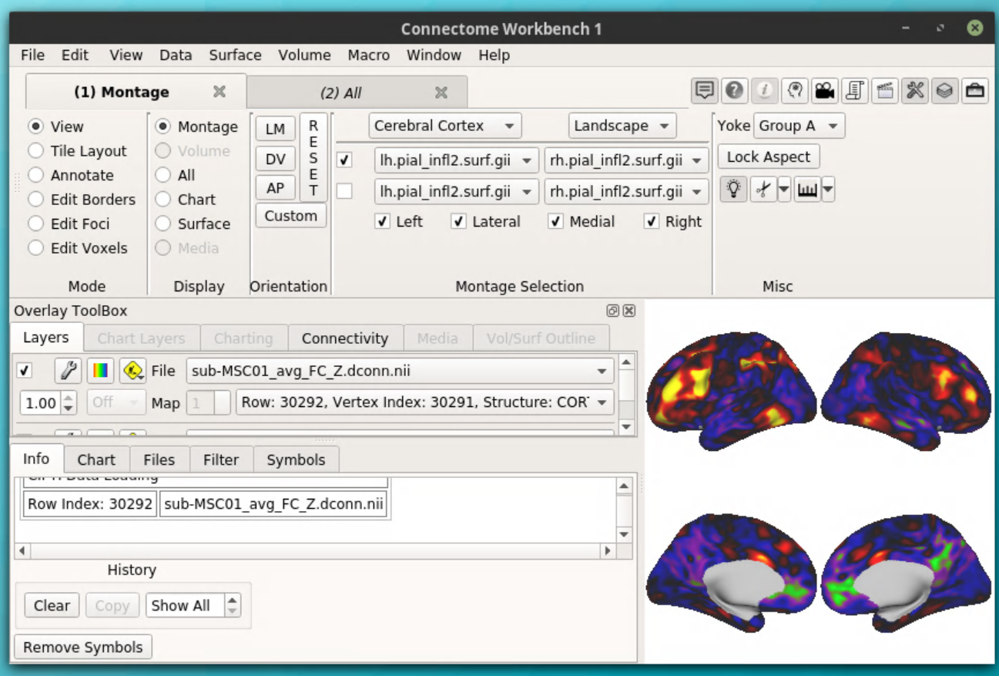

Seed-based Analysis Step 3
==========================

HCP Workbench Introduction
**************************

The Human Connectome Project developed the workbench package to work with their massive dataset and somewhat rare data formats--namely surface files (cifti, gifti, etc.). As part of the workbench suite, there is a command line interface with many useful commands for manipulating and working with surface files as well as a the unique viewer (Workbench View or wb_view). A comprehensive help guide for the viewer can be found online (https://wiki.humanconnectome.org/display/WBPublic/Connectome+Workbench+Help+Guide). Additionally, the workbench suite is fairly simple to download (think download and unzip) and can be found on the HCP website (https://humanconnectome.org/software/get-connectome-workbench). 

Within the context of seed-based analyses, workbench is very useful! For this tutorial we will use workbench to load the surface gifti files, the cifti .dconn.nii file, pick a seed, and threshold the resulting map.

Opening Workbench
*****************

.. note:: Workbench is much faster on your local computer, so if possible download your files and work from there. Unfortunately, cifti .dconn files can be quite large, which means we will be loading them primarily from the supercomputer.

To reliably open workbench on the supercomputer, we will `cd` to the location of the workbench download!

.. code-block:: bash

    cd workbench
    cd bin_rh_linux64/
    ./mesagl_wb_view #this will launch the application

A window will pop up giving you the opportunity to open a previous 'scene' (a file that contains instructions for loading files in a specific way). Choose the 'cancel' button since you probably haven't saved any scenes before.

.. image:: s3_1.png 

After pressing 'cancel', the main viewer will be displayed. 

From here, we can open our files.

Loading Surface Gifti Files
***************************

In order to display the cifti .dconn file, an underlying surface file needs to be loaded first. If you recall, cifti files don't store data about structure (only vertex number), so a surface is necessary to overlay the cifti data. For workbench to recognize a file as a surface file, the suffix must be '.surf.gii'.

To open the file, go to File > Open File and select the directory with your surface files. Be sure to change the "Files of type" option from .spec files (the default) to "Any File". 

.. image:: s3_4.png 

The surface files will then be displayed!

.. note:: In order to overlay cifti files onto surface files, the surface files must have the same number of vertices as the cifti files! In other words, the resolution of both the cifti and the gifti files must match!

Loading Cifti Files
*******************

With the surface files loaded, we can proceed to the cifti file! We will follow the same steps to open the cifti file. 

Next, check the box next to the loaded .dconn file. 

There will be no change in the display until after you pick a seed, so don't panic when nothing happens!

Picking a Seed
**************

Hopefully you have already chosen some seed regions `a priori`. You can proceed to select a seed simply by clicking on the surface. 

The connectivity map will automatically be displayed using the default thresholds and color lookup tables. 

Removing a Seed
***************

If you desire to remove a seed, simply select the "Remove Symbols" button. This will remove the white seed symbol but retain the connectivity map. Once the seed is removed, you can go ahead and select a new seed on the surface. 

The seed symbol has now been removed. 

Thresholding and Other Palette Customizations
*********************************************

To change the thresholding, select the wrench button next to the file you would like to theshold (1 in the following image). To show the range of values displayed, select the colors button (2 in the following image). 

Your thresholding settings will depend on your data and study, so this might be a good thing to consult the literature and/or your advisor on. For reference, here is one example of threshold settings and their resulting maps. 

To change the background of the display, go to File > Preferences and change the "Window Foreground" in the display. 

The next step is to display network parcellations alongside the connectivity map!    