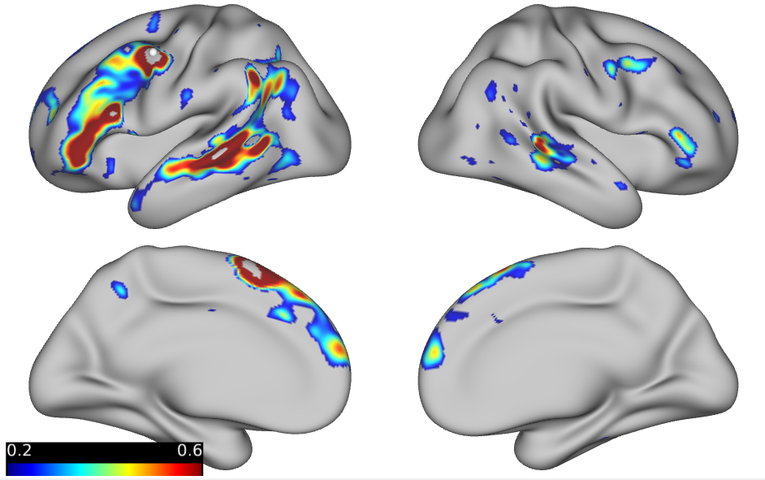
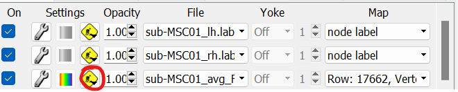
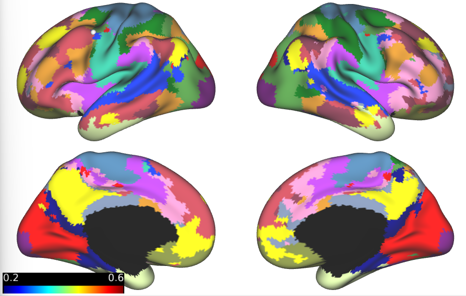
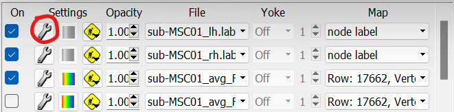
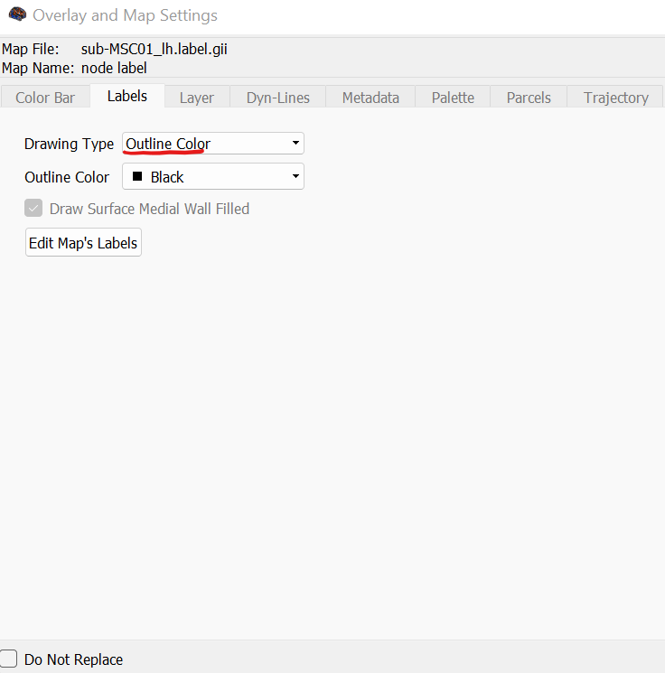
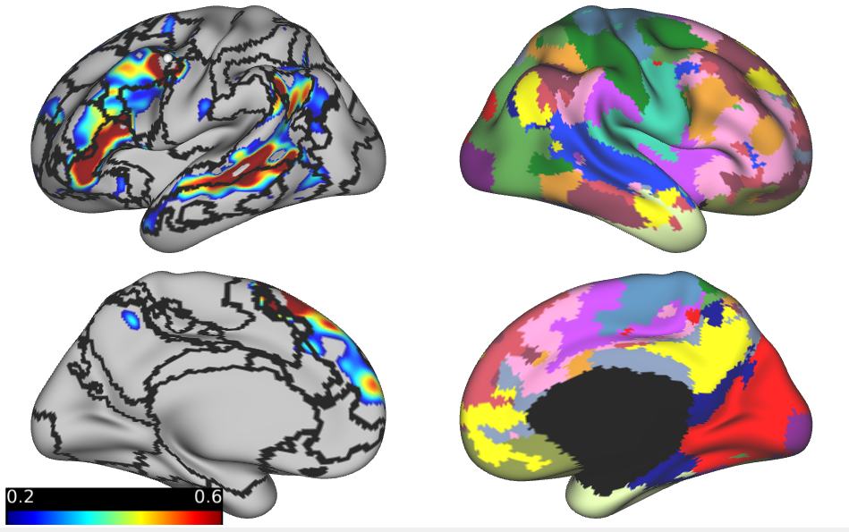
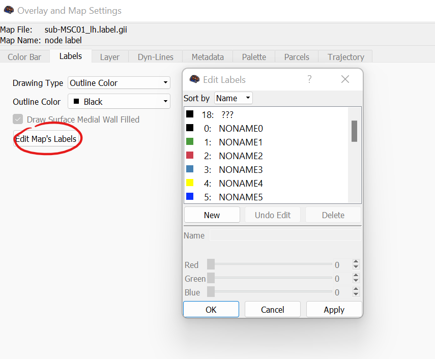
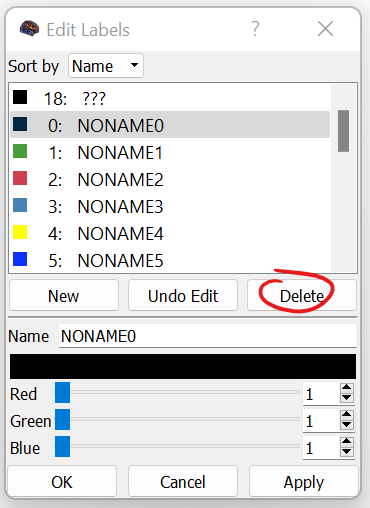
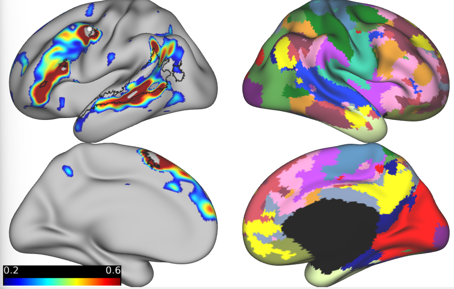

Seed-based Analysis Step 4
==========================

For this step, we will walk through how to display both network parcellations and a seed-based connectivity map simultaneously. This will involve first loading up parcellation label files (.label.gii) followed by changing the settings to display a single network. Skip this step if you don't have individual parcellations. 

Overlaying Network Parcellations
********************************

We will start up where we left off with Step 3: displaying the connectivity map. 

To overlay the parcellation files, first open your label files (following the same steps to open these as with the surface files). Once these are loaded, add overlays and position them above the .dconn file as so. To add a layer above the .dconn file, select the yellow working man button and choose "Add Overlay Above". 

This will display the parcellations. 

Displaying a Single Network
***************************

Now that the parcellations are loaded, we can go ahead and adjust the settings to just show the network boundaries and display a single network (hopefully the network that corresponds with the network identified with the seed-based connectivity analysis). 

The first step is to display the network borders without fill. To do this, select the silver tool icon next to the overlay. 

In the dialog box, change "Drawing Type" from "Filled" to "Outline Color".

This will update the hemisphere that you selected. 

Now, to display a single network, select "Edit Map's Labels". This will open a new dialog box displaying each network in the parcellation file. 

To display a single network, go ahead and delete the undesired networks. This won't delete them from the original file unless you choose to save these changes to the original parcellation file (not necessarily recommended). 

.. note:: This dialog box also contains the settings to adjust network colors. 

Here is the result for the left hemisphere. These steps will need to be repeated for the right hemisphere!

As you can see, the seed and the selected network don't quite line up. 

The next step is saving out our settings configuration so we can easiliy reload and replicate the analysis!

