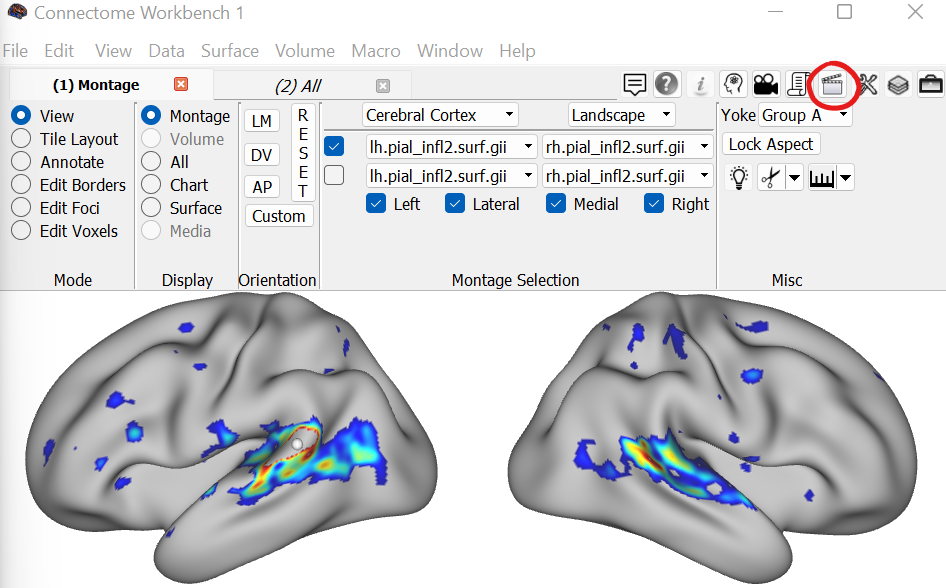
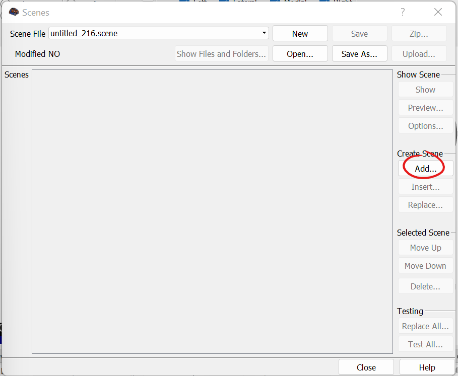
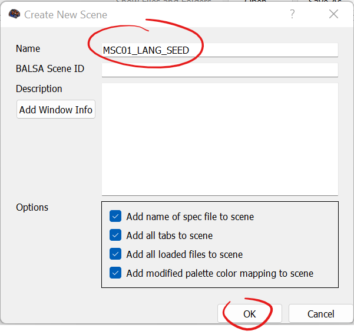
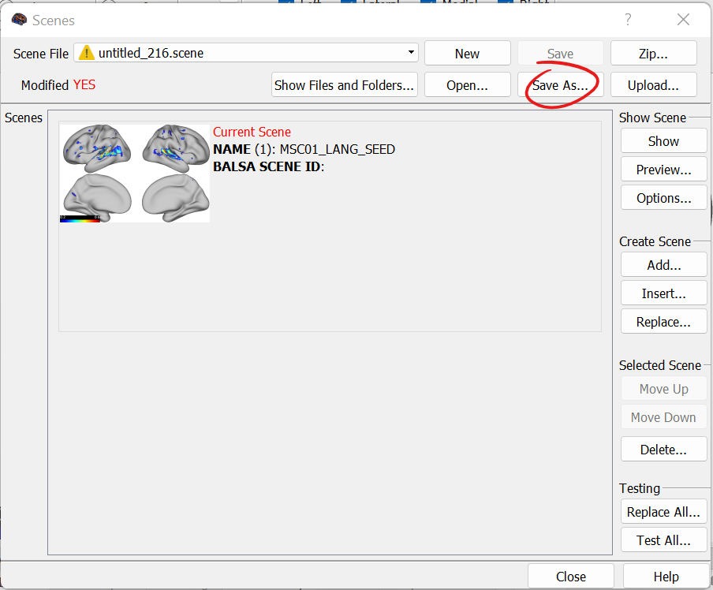
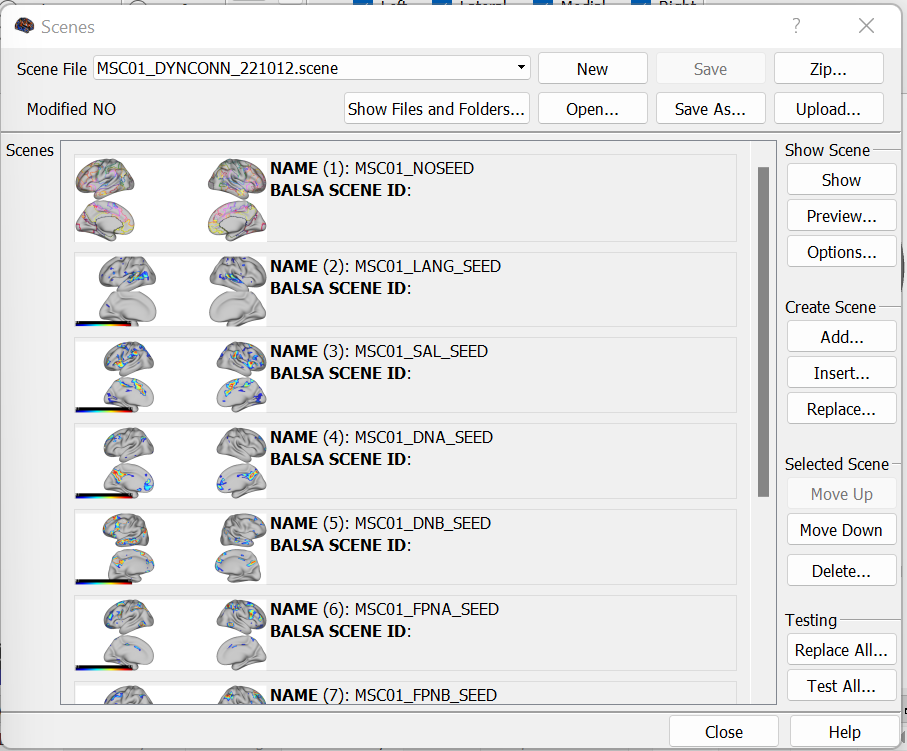
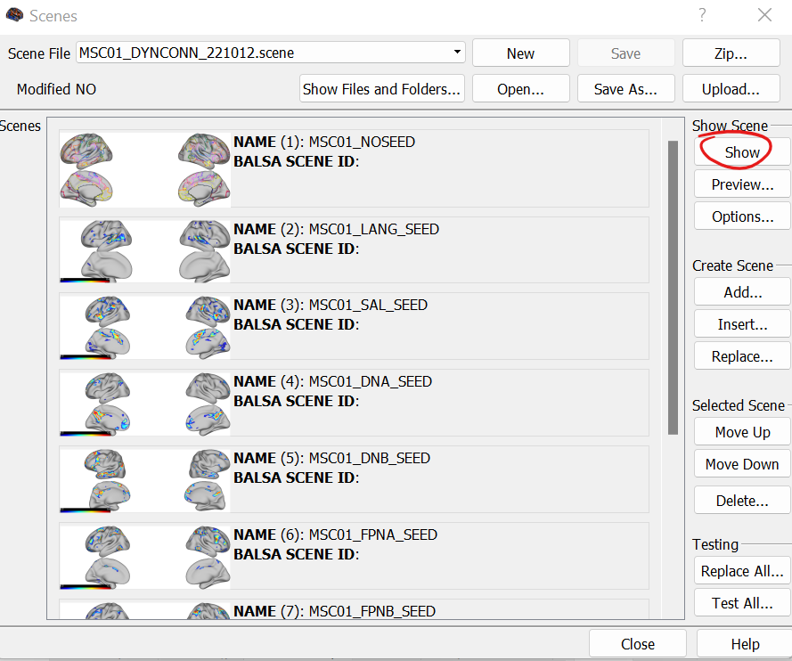
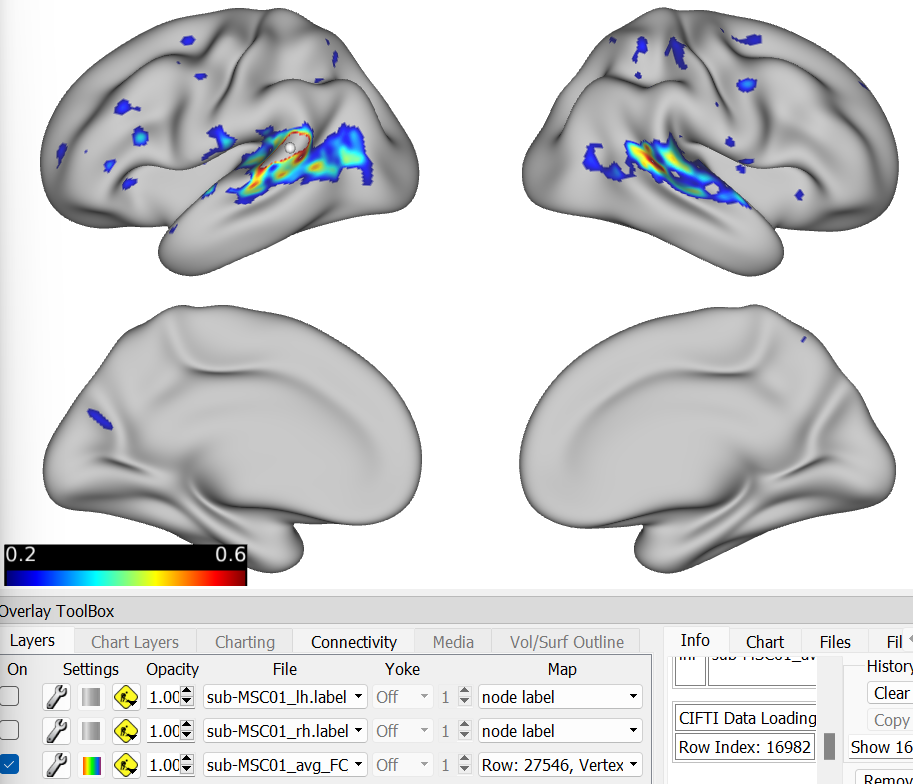
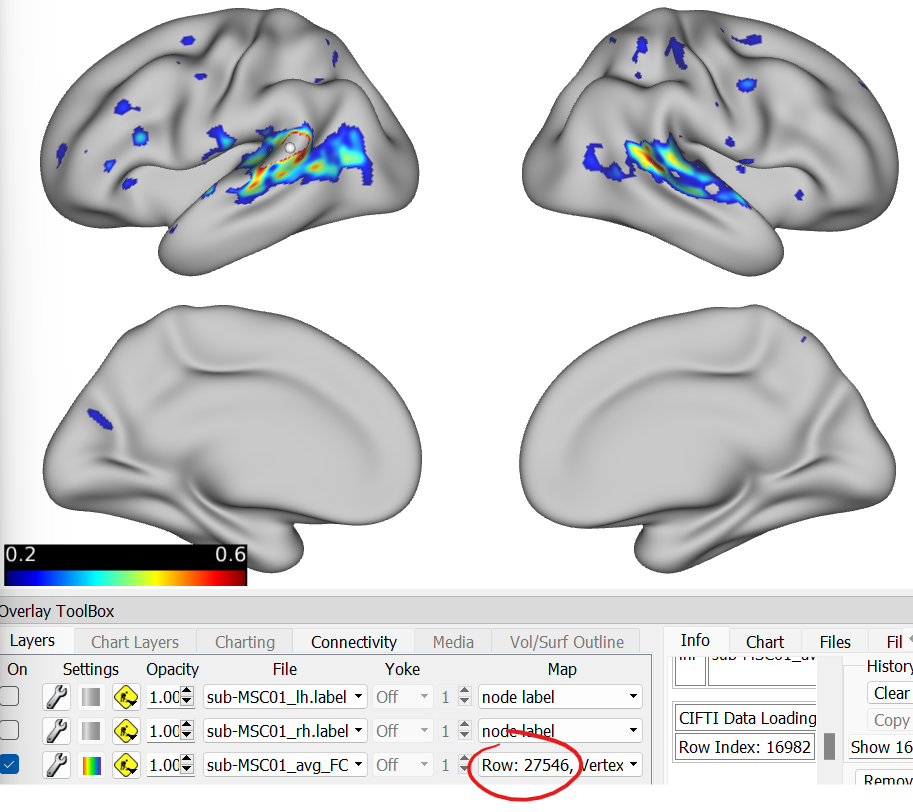
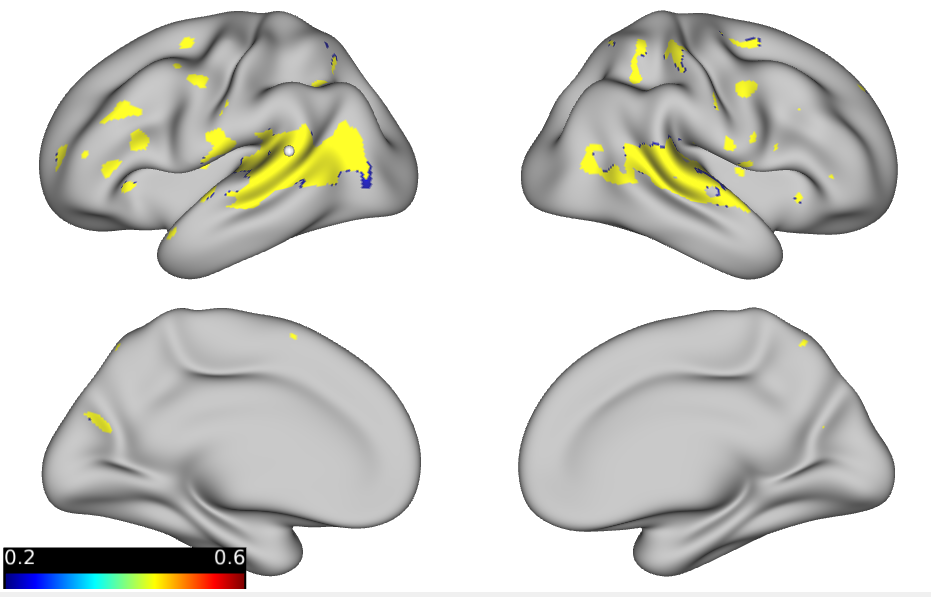
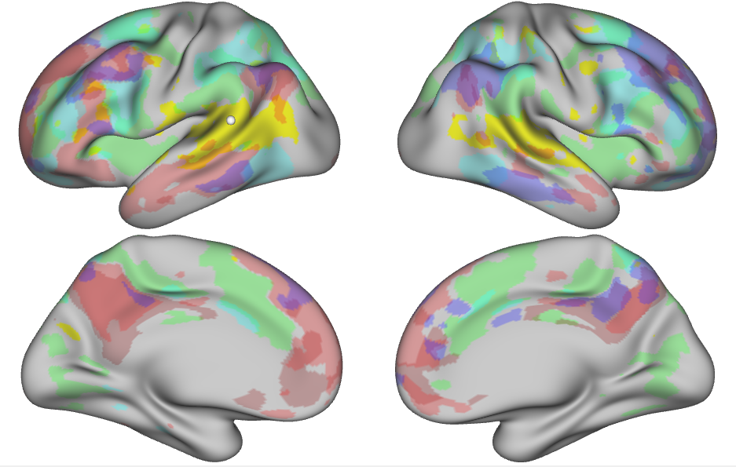

Seed-based Analysis Step 5
==========================

Seed-based analyses may seem a little "touch and go" at first, but one way to introduce reproducibility is to save the resulting connectivity maps as scenes. By doing this, we can effortlessly reload analyses with their exact settings.

Saving out a Scene
******************

To save out a scene, we will first create a scene and then save that scene to a Workbench-specific .scene file.

First, we will locate the clapboard button which can be found in the top right of the GUI.

This will open a new dialog box. To create the initial scene, we can select the "Add" button. 

Another dialog box will appear asking for a scene name. After entering the name for our scene, we can close the dialog box. 

The scene has now been created! However, unless we save it to a file, we will lose it. To save the scene, select "Save As" and save a .scene file.

In the event that you have multiple seeds and desire to save multiple scenes within a single file, simply add more scenes! If you need to overwrite a scene, choose the "Replace" option. 

Loading a Scene
***************

Scenes are simple to work with! To load a specific seed, go ahead and select a scene from the options and choose "Show". 

Like magic, all of your previously selected settings will be in place! 

.. note:: A scene will only load if the file paths are unchanged! If files have been moved, the scene will fail to load properly!

Bonus: Saving a Connectivity Map as a Mask or Gifti
***************************************************

Connectivity maps can be saved out as gifti files for concurrent viewing! To do this, we will walk through an example. 

In this example, a seed approximating the language network has been selected. To create a matching gifti file, we need to know what column of the connectivity matrix to save from! This information can be found in the Overlay Toolbox.

For this network, the corresponding seed is in row 27546. However, since our connectivity matrices are symmetrical across the diagonal, this means that the seed is `column` 27546. We can now input this information into a Matlab script. 

.. code-block:: matlab

    %Purpose: Convert a seed-based connectivity map displayed in workbench to a gifti that can be displayed like a parcel 
    %Inputs: Vertex number of seed, symmetrical connectivity matrices (.dconn.nii)
    %Outputs: Gifti file for each seed
    %Written by M. Peterson, Nielsen Brain and Behavior Lab under MIT License 2022

    %To run: 
    %	 1. Claim computing resources using salloc (ex: `salloc --mem-per-cpu 300G --time 2:00:00 --x11`)
    %    2. Source your CBIG config file to set up CBIG environment.	 
    %    3. Load matlab module: `ml matlab/r2018b`
    %	 4. Enter the command `LD_PRELOAD= matlab`

    %Set paths
    project_dir='/fslgroup/fslg_fun_conn/compute/MSC_analysis/quant_metrics/FC_matrices';
    out_dir='/fslgroup/fslg_spec_networks/compute/results/MSC_analysis/DYNCONN/gifti';
    gifti_template_dir = '/fslgroup/fslg_spec_networks/compute/results/fsaverage_surfaces';

    % Make out_dir
    if(~exist(out_dir))
            mkdir(out_dir);
    end

    %Set variables and input seed row into seedlist  (multiple seeds can be ran at once)
    %MSC01    
        sublist=["MSC01"]; 
        seedlist=["27546"];     
        
    %Loop through each subject/seed
    for sub = sublist
        
        %load cifti .dconn file
        filename = strcat('sub-', sub, '_avg_FC_FisherZ.mat');
        fullname = fullfile(project_dir, filename);
        load(fullname);
        zmat=z;    
        
        for seed = seedlist
        
            %save seed column as new variable
            seed_col=zmat(:,str2num(seed));
            
            %threshold seed column (less than .2 as indicated in Braga et al.
            %(2020)
            seed_col(seed_col<.2)=0;
            seed_col(seed_col>=.2)=1;
            
            %split seed col into LH and RH
            rows = size(zmat, 1);
            lh_labels=seed_col(1:(rows/2));
            rh_labels=seed_col((rows/2 + 1):end);
        
            %write out seed as gifti .shape.gii
                %grab resolution
                resolution = size(lh_labels,1);        
                %output filenames
                fname_lh = strcat('sub-', sub, '_seed-', seed, '_lh.shape.gii');
                fname_rh = strcat('sub-', sub, '_seed-', seed, '_rh.shape.gii');

                full_lh = fullfile(out_dir,strcat('sub-',sub), fname_lh);
                full_rh = fullfile(out_dir,strcat('sub-',sub), fname_rh);

                %load in template .shape.gii file 
                g_left = gifti(fullfile(gifti_template_dir, 'FS6_lh.shape.gii'));
                g_right = gifti(fullfile(gifti_template_dir, 'FS6_rh.shape.gii'));

                %replace vertex values in templates with AI values
                metric = single(ones(resolution, 1));
                g_left.cdata = metric;
                g_right.cdata = metric;

                g_left.cdata = lh_labels;
                g_right.cdata = rh_labels;
        
                %save output
                save(g_left, char(full_lh));
                save(g_right, char(full_rh));
        end
    end

This script loops through the subject specified and the list of seeds provided. First, it will grab the corresponding column of data for that seed and then threshold it (currently set to .2). Vertices are binarized according to whether they meet the minimum threshold or not. From here, the column is split into the left and right hemispheres (the top half of the column is the left hemisphere). Next, an empty gifti file is created by copying over a template gifti file and filling it to the correct resolution with zeros. Then the left and right empty gifti files are filled with the binarized connectivity data.

The resulting gifti overlay can be seen below. 

Multiple gifti connectivity maps can be displayed simultaneously to give the researcher an idea of how they overlay or interconnect. 

