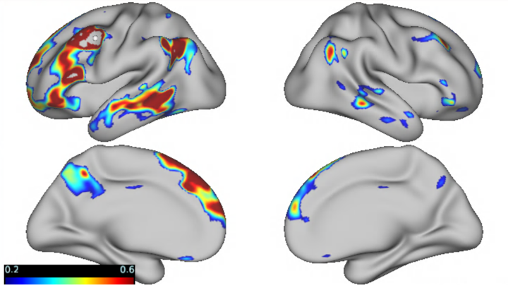
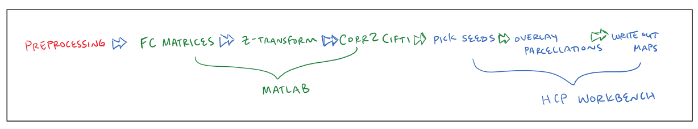

Seed-based rs-fMRI Analysis Overview
====================================

Introduction
************

The seed-based analysis approach to rs-fMRI connectivity is widely used in the fMRI literature. It makes for an interpretable result and its graphical output is highly intuitive for a reader or even a layperson to understand. And, depending on the specifics chosen by the investigators, the method can be rigorous and yield a high inter-rater reliability.

As an overview, the seed-based approach entails choosing seed regions a priori, calculating whole-brain functional connectivity matrices, selecting seeds, and displaying the resulting connectivity maps (see the image below). These analyses can lead to group comparisons (e.g., answering how connectivity between two regions differ between a clinical and neurotypical population) or other analyses (e.g., surface area of highly connected vertices).

The seed-based analysis in this tutorial is based off of the Braga et al. (2020) seed-based analysis (see https://journals.physiology.org/doi/full/10.1152/jn.00753.2019). 

.. note:: For this tutorial, we will be performing the seed-based analysis on the surface (think vertices, not voxels). This is not compatible with subcortical or cerebellar seeds.

Prerequisite Processing
***********************

This tutorial will assume that we are working with preprocessed rs-fMRI runs projected to the surface. Ideally, this would mean that Freesurfer and the CBIG2016 preprocessing pipeline have previously been run. A tutorial on implementing the CBIG2016 preprocessing pipeline can be found here: https://neurodocs.readthedocs.io/en/latest/cprep/cprep_ov.html. 

Processeing Steps 
*****************

The general workflow will include calculating a full-surface functional connectivity correlation matrix for each subject, standarizing the matrix, converting the matrix to cifti format, picking seeds, visualizing the resulting connectiivty maps, and writing out maps and scenes to easily recreate analyses.

Required Software
*****************

* Matlab (version r2018b preferred). On the supercomputing cluster this is as simple as `ml matlab/r2018b`.
* HCP Workbench (see https://humanconnectome.org/software/get-connectome-workbench). This is a download and unzip kind of installation. 
* CBIG Github Repository (`git clone https://github.com/ThomasYeoLab/CBIG`)

