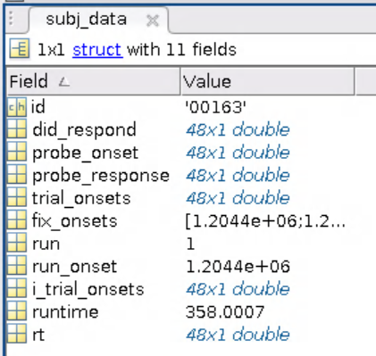
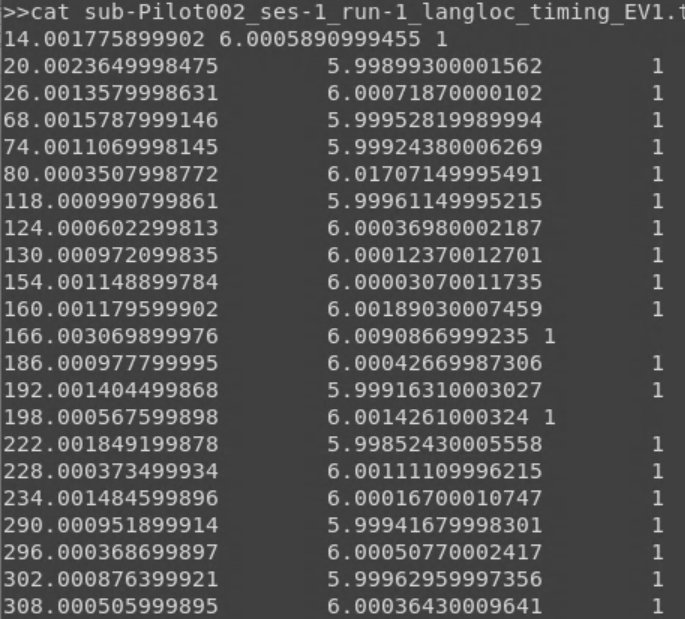
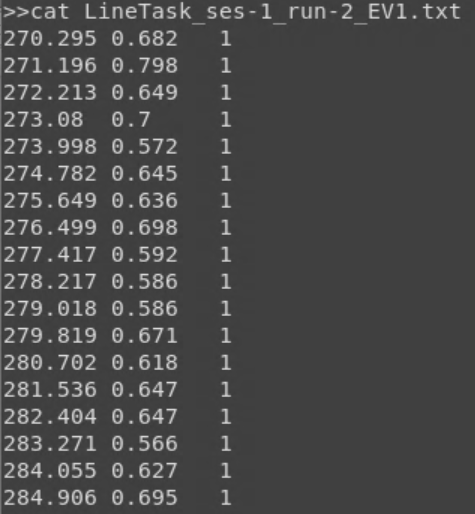

Task Analysis Step 1: Timing Files
==================================

What are timing files?
**********************

Timing files are simple text files that contain the start time of a task trial, the duration of that trial, and the task contrast. 

For example, let's use a language localizer task. For this task, participants read sentences with words and strings of nonwords. So, our trial onset times will be whenever the sentences or nonwords are shown on the screen, the trial durations are the length of time the sentence or nonwords blocks are shown, and the task contrast label will indicate if it is a sentence or nonwords trial. This task can be downloaded from the EvLab `website <https://evlab.mit.edu/funcloc/>`__. 

Creating timing files
*********************

It is best to design your experiment with your first-level model in mind (and hence the timing files, which contribute to the formulation of that design). However, if you are using data that has been previously collected, it can be a little tricky to know where to start with these. However, this can be simplified into three basic steps:

1. Calculate trial onset times
2. Calculate trial durations
3. Label each trial with its particular task contrast label 

We will create these timing files for two different tasks using two different approaches: MATLAB and Python

MATLAB timing files
********************

1. Load MATLAB, claim an `salloc` job, and launch MATLAB

.. code-block:: console
	
    $ ml matlab/r2018b
    $ salloc --mem-per-cpu 15G --time 24:00:00 --x11
    $ LD_PRELOAD= matlab

2. In MATLAB, view our example .mat task output file, which you can download on `Github <https://github.com/peter3200/NeuroDocs/blob/main/example_data/kan_langloc_ses-1_run-1_set1.mat>`__.

.. code-block:: console

    $ load('kan_langloc_ses-1_run-1_set1.mat')

Within the `subj_data` structure, there are a few variables:

Here is what each variable means in the context of the language localizer task
   * ``id, set, run``: these are defined when the task is run in the scanner
   * ``run_onset``: the beginning of the timer for this run
   * ``fix_onsets``: the value of the timer at the beginnig of each fixation block
   * ``i_trial_onsets``: used to store the expected length of trials
   * ``trial_onsets``: the actual individual trial onset times
   * ``did_respond``: if thte subject actually pressed a key during the attention probe
   * ``probe_onset``: when the participant responds to the attention probe
   * ``runtime``: end time minus start time
   * ``rt``: probe_response minus probe_onset

.. note:: When time is recorded for this task, it is absolute relative to the internal computer clock, so to get the relative time of trial_onset with respect to run_onset we'll need to calculate trial_onset - run_onset to get a more interpretable value.

3. Create two timing files (EV1 and Ev2). The script is available to lab members on `Github <https://github.com/Nielsen-Brain-and-Behavior-Lab/AutismHemisphericSpecialization/blob/main/activation_maps/timing_files/make_langloc_timing_220407.m>`__.

The first step is to set up paths and basic variables:

.. code-block:: matlab

   % Step 0: Set paths and variables
   timing_project_dir = '/fslgroup/fslg_spec_networks/compute/code/timing_files/raw_data';
   timing_prefix = 'kan_langloc_ses-';
   SUB = 'Pilot002';
   SES = '1'; 
   RUN = '2';
   SET = '1';

Next, we will load the .mat file and create more variables:

.. code-block:: matlab

   % Step 1: Load files, calculate vars 
   ses = num2str(SES);
   run = num2str(RUN); 
   set = num2str(SET);
   timing_run = '_run-';
   timing_set = '_set';
   timing_suffix = '.mat';
   tf_name = strcat(timing_prefix,ses,timing_run,run,timing_set,set,timing_suffix);
   tf_str = fullfile(timing_project_dir,SUB,tf_name);
   new_tf = load(tf_str); %load the file

   out_sub = '/sub-';
   out_ses = '/ses-';
   out_ses2 = '_ses-';
   out_func = '/func';
   out_suffix = '_langloc_timing.txt';
   out_dir = '/fslgroup/fslg_spec_networks/compute/results/fmriprep_results/fmriprep/sub-';
   output_dir = strcat(out_dir,SUB,out_ses,ses,out_func); %output directory location 
   output_name = strcat(out_sub,SUB,out_ses2,ses,timing_run,run,out_suffix); %output filename
   output_total = fullfile(output_dir,output_name);

Now we are ready to create different timing files depending on the set. For this task, the trials are presented in a different order depending on if the set is 1 or 2.

.. code-block:: matlab

   %Step 2: Create different timing files depending on if the set is 1 or 2  (the sets are counterbalanced in presentation of S vs N)
   if RUN == '1' %RUN 1 = SNNS - NSNS - SNSN - NSSN (words for 5400 ms)    
    %Create EV 1: Sentence
    all_onset = [new_tf.subj_data.trial_onsets - new_tf.subj_data.run_onset];
    fix_onset = [new_tf.subj_data.fix_onsets - new_tf.subj_data.run_onset];
    NONWORD = [4 5 6 7 8 9 13 14 15 19 20 21 28 29 30 34 35 36 37 38 39 46 47 48]; %cells that contain NONWORD onset time     
    SENTENCE = [1 2 3 10 11 12 16 17 18 22 23 24 25 26 27 31 32 33 40 41 42 43 44 45]; %cells that contain SENTENCE onset time
    onset1 = all_onset(SENTENCE,1); %list of onset times for SENTENCES
    fix1 = fix_onset(1,1); %onset time for first fixation
    fix2 = fix_onset(2,1);
    fix3 = fix_onset(3,1);
    fix4 = fix_onset(4,1);
    fix5 = fix_onset(5,1);		
    con_fix = zeros(52,1);    
    con_fix(13) = fix2; %add in fixation onset times  
    con_fix(26) = fix3;
    con_fix(39) = fix4;
    con_fix(52) = fix5;
    con_fix(1:12) = all_onset(1:12); %add in task onset times
    con_fix(14:25) = all_onset(13:24);
    con_fix(27:38) = all_onset(25:36);
    con_fix(40:51) = all_onset(37:48);
    all_dur = diff(con_fix); %find duration for fixation and task
    NW_dur = [4 5 6 7 8 9 14 15 16 20 21 22 30 31 32 36 37 38 40 41 42 49 50 51]; %cells that contain duration for NONWORDS
    ST_dur = [1 2 3 10 11 12 17 18 19 23 24 25 27 28 29 33 34 35 43 44 45 46 47 48]; %cells that contain duation for SENTENCE
    duration1 = all_dur(ST_dur, 1); %grab duration for sentence values	
    value1 = repelem(1,24)';
    EV1 = table(onset1, duration1, value1); %create table
    out_suffix = '_langloc_timing_EV1.txt';
    out_dir = '/fslgroup/fslg_spec_networks/compute/results/fmriprep_results/fmriprep/sub-';
    output_dir = strcat(out_dir,SUB,out_ses,ses,out_func); %output directory location 
    output_name = strcat(out_sub,SUB,out_ses2,ses,timing_run,run,out_suffix); %output filename
    output_total = fullfile(output_dir,output_name);
    writetable(EV1, output_total, 'Delimiter', '\t','WriteVariableNames',0);
    %Create EV 2: Nonwords
    onset2 = all_onset(NONWORD,1); %nonword onset tme
    duration2 = all_dur(NW_dur,1);
    value2 = repelem(1,24)';
    EV2 = table(onset2, duration2, value2); %create table
    out_suffix = '_langloc_timing_EV2.txt';
    out_dir = '/fslgroup/fslg_spec_networks/compute/results/fmriprep_results/fmriprep/sub-';
    output_dir = strcat(out_dir,SUB,out_ses,ses,out_func); %output directory location 
    output_name = strcat(out_sub,SUB,out_ses2,ses,timing_run,run,out_suffix); %output filename
    output_total = fullfile(output_dir,output_name);
    writetable(EV2, output_total, 'Delimiter', '\t','WriteVariableNames',0);

If it is the second set (run), then we will create the timing files using this code:

.. code-block:: matlab

   else   %RUN 2 = NSSN - SNSN - NSNS - SNNS (words for 5400 ms)
    %EV2: Nonwords
    all_onset = [new_tf.subj_data.trial_onsets - new_tf.subj_data.run_onset];
    fix_onset = [new_tf.subj_data.fix_onsets - new_tf.subj_data.run_onset];
    SENTENCE = [4 5 6 7 8 9 13 14 15 19 20 21 28 29 30 34 35 36 37 38 39 46 47 48]; %cells that contain SENTENCE onset time     
    NONWORD = [1 2 3 10 11 12 16 17 18 22 23 24 25 26 27 31 32 33 40 41 42 43 44 45]; %cells that contain NONWORD onset time
    onset2 = all_onset(NONWORD,1);
    fix1 = fix_onset(1,1); %onset time for first fixation
    fix2 = fix_onset(2,1);
    fix3 = fix_onset(3,1);
    fix4 = fix_onset(4,1);
    fix5 = fix_onset(5,1);		
    con_fix = zeros(52,1);    
    con_fix(13) = fix2; %add in fixation onset times  
    con_fix(26) = fix3;
    con_fix(39) = fix4;
    con_fix(52) = fix5;
    con_fix(1:12) = all_onset(1:12); %add in task onset times
    con_fix(14:25) = all_onset(13:24);
    con_fix(27:38) = all_onset(25:36);
    con_fix(40:51) = all_onset(37:48);
    all_dur = diff(con_fix); %find duration for fixation and task
    ST_dur = [4 5 6 7 8 9 14 15 16 20 21 22 30 31 32 36 37 38 40 41 42 49 50 51]; %cells that contain duration for SENTENCES
    NW_dur = [1 2 3 10 11 12 17 18 19 23 24 25 27 28 29 33 34 35 43 44 45 46 47 48]; %cells that contain duation for NONWORDS
    duration2 = all_dur(NW_dur,1); %duration
    value2 = repelem(1,24)';
    EV2 = table(onset2, duration2, value2); %create table
    out_suffix = '_langloc_timing_EV2.txt';
    out_dir = '/fslgroup/fslg_spec_networks/compute/results/fmriprep_results/fmriprep/sub-';
    output_dir = strcat(out_dir,SUB,out_ses,ses,out_func); %output directory location 
    output_name = strcat(out_sub,SUB,out_ses2,ses,timing_run,run,out_suffix); %output filename
    output_total = fullfile(output_dir,output_name);
    writetable(EV2, output_total, 'Delimiter', '\t','WriteVariableNames',0);
    %EV1: Sentences
    onset1 = all_onset(SENTENCE,1);
    duration1 = all_dur(ST_dur,1);
    value1 = repelem(1,24)';
    EV1 = table(onset1, duration1, value1); %create table
    out_suffix = '_langloc_timing_EV1.txt';
    out_dir = '/fslgroup/fslg_spec_networks/compute/results/fmriprep_results/fmriprep/sub-';
    output_dir = strcat(out_dir,SUB,out_ses,ses,out_func); %output directory location 
    output_name = strcat(out_sub,SUB,out_ses2,ses,timing_run,run,out_suffix); %output filename
    output_total = fullfile(output_dir,output_name);
    writetable(EV1, output_total, 'Delimiter', '\t','WriteVariableNames',0);
   end

4. Look for and view the output EV files (found in your out_dir, which in this case is the fmriprep results folder)

Python timing files
*******************

We are going to use a different task and a different language to approach timing files! Some background: this "linetask" is a line bisection task, for which participants view a vertical line bisected by a horizontal line. For LENGTH trials, they are asked to select if the top or bottom section of the vertical line is longer. For COLOR trials, they determine if the top or bottom of the vertical line is brighter. Unlike the language task, trial durations are determined by the participant's response speed. 

0. The raw output for this task is in EPrime format. These EPrime files were first converted to .excel files using EPrime and then to .csv files using Excel. You can download an example .csv output file to use with this script from `Github <https://github.com/peter3200/NeuroDocs/blob/main/example_data/LineTask_ses-1_run-2.csv>`__.

1. Load python

.. code-block:: console
   
   $ ml python/3.6

2. Run our script! Lab members can access this script on `Github <https://github.com/Nielsen-Brain-and-Behavior-Lab/AutismHemisphericSpecialization/blob/main/activation_maps/timing_files/make_landmark_timing_x2_220408.py>`__. 

.. code-block:: console

   $ python make_landmark_timing_x2_220408.py

3. Check for output in your output directory (here specified as input folder). There should be two EV files for each run. 

**What did the python script do?**

- First, we set up our environment, loading the needed modules and setting our input directory

.. code-block:: python

  #!/usr/bin/env python
  #Load packages
   from pathlib import Path
   import time
   import os
   from os.path import dirname, join as pjoin
   import sys
   import scipy.io #loads .mat files
   import csv
   import numpy as np
   import pandas as pd
   import glob
  #Loop through each subject/sess/run
   directory: str="/fslgroup/fslg_spec_networks/compute/code/timing_files/raw_data"

- Next, we set up our `for loops` to loop through each subject and then each landmark task output file within that subject directory. Then we went to work grabbing our timing file components.

.. code-block:: python

   sub_count = 0
   for sub in os.scandir(directory): #loop through each subject within the "directory"
	sub_count = sub_count + 1
	sub_name = str(sub.name)
	subdir = pjoin(directory, sub_name)
	counter = 0
	   for file in glob.iglob(f'{subdir}/LineTask_ses-*.csv'): #loop through each landmark task output file
		   counter = counter + 1
	   	#Create full dataset
		   orig_df = pd.read_csv(file, header=1, usecols = [83, 86, 114, 117, 119]) #grab all of the data
		   orig_df['value'] = 'NaN' #create empty column called 'value'
		   orig_df['value'] = orig_df['Procedure[Trial]'].apply(lambda x: '1' if x == "ColTrial" else '2') #if the type of trial is ColTrial, give it a value os 1, otherwise 2
		   orig_df = orig_df.fillna(0) #replace NAs with 0 so you can combine columns to make single RT and OT variables
		   orig_df['RT'] = orig_df['ColSlide.RT'] + orig_df['LenSlide.RT'] #create a single RT variable
		   orig_df['OT'] = orig_df['ColSlide.OnsetTime'] + orig_df['LenSlide.OnsetTime'] #create a single OT variable
		   new_RT_df = orig_df[['RT', 'value']]
		   new_OT_df = orig_df[['OT']]
		   gold_df = pd.concat([new_OT_df, new_RT_df], axis=1) #create dataframe with onset, response time, and value
		   gold_df = gold_df.iloc[1: , :] #reemove the first row
		   gold_df['OT'] = gold_df['OT'].div(1000) #convert miliseconds to seconds for OT
		   gold_df['RT'] = gold_df['RT'].div(1000) #convert miliseconds to seconds for RT

- After that, we created two EV files -- one for the LEN trials and one for the COL trials and then saved them in the input directory.

.. code-block:: python

   #Create EV1 dataset and timing file (LEN trials)
		EV1_df = gold_df.copy(deep=True)
		EV1_df.drop(EV1_df.index[EV1_df['value'] == "1"], inplace=True) #drop all ColTrials==1
		EV1_df['value'] = EV1_df['value'].apply(lambda x: '1' if x == "2" else '1')  #replace 2 with 1
		EV1_df.drop(EV1_df.index[EV1_df['RT'] == 0], inplace=True) #remove RT of 0.0

	#Create EV2 dataset and timing file (COL trials)
		EV2_df = gold_df.copy(deep=True)
		EV2_df = EV2_df[EV2_df.value!= "2"] #Drop LEN trials (==2)		
		EV2_df.drop(EV2_df.index[EV2_df['RT'] == 0], inplace=True) #remove RT of 0.0	

	#Save the EV1 (LEN) dataframe as .txt file
		new_file = file[:-4]
		EV1_out_name = new_file + '_EV1' + '.txt' 
		EV1_out_file = pjoin(directory, EV1_out_name)
		EV1_df.to_csv(EV1_out_file, sep='\t', header=False, index=False)

	#Save the EV2 (COL) dataframe as .txt file 
		EV2_out_name = new_file + '_EV2' + '.txt'
		EV2_out_file = pjoin(directory, EV2_out_name)
		EV2_df.to_csv(EV2_out_file, sep='\t', header=False, index=False)

Other examples of timing files
******************************

As a primer with a simplified example, we highly recommend Andy's Brain Book! Check out `Chapter 5 <https://andysbrainbook.readthedocs.io/en/latest/fMRI_Short_Course/Statistics/05_Creating_Timing_Files.html>`__.
