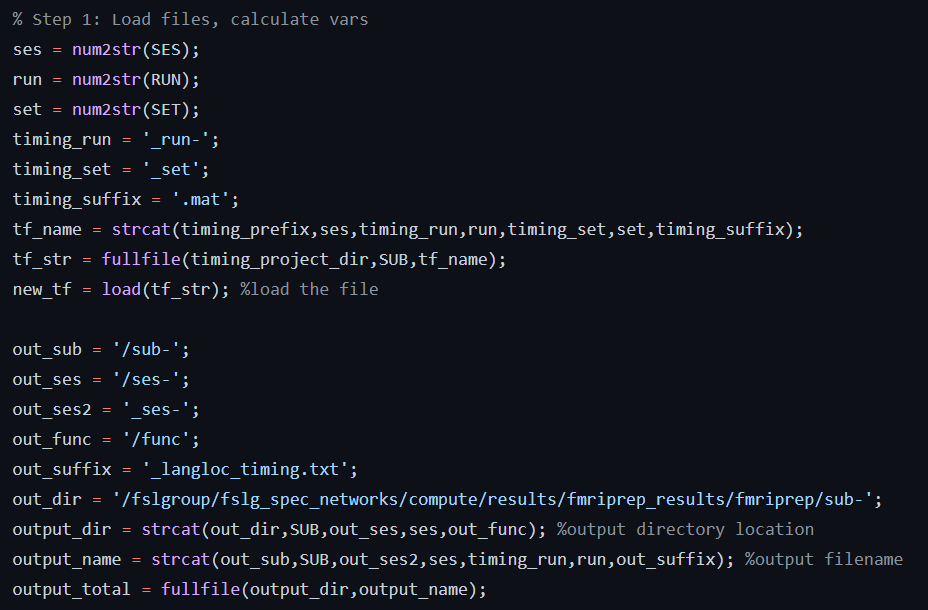
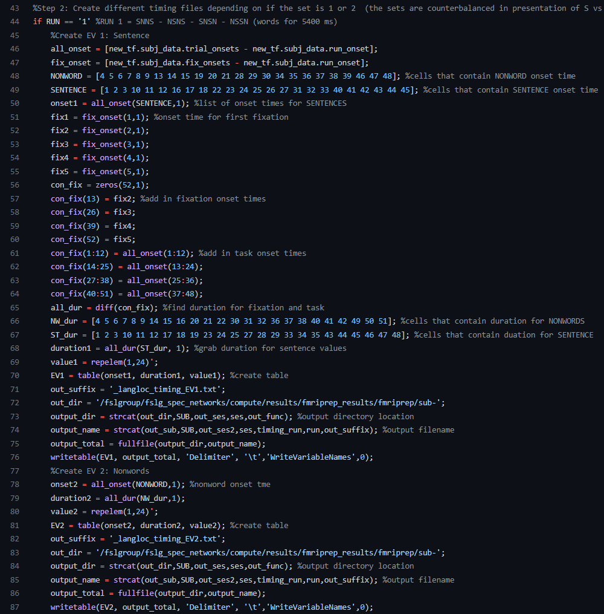
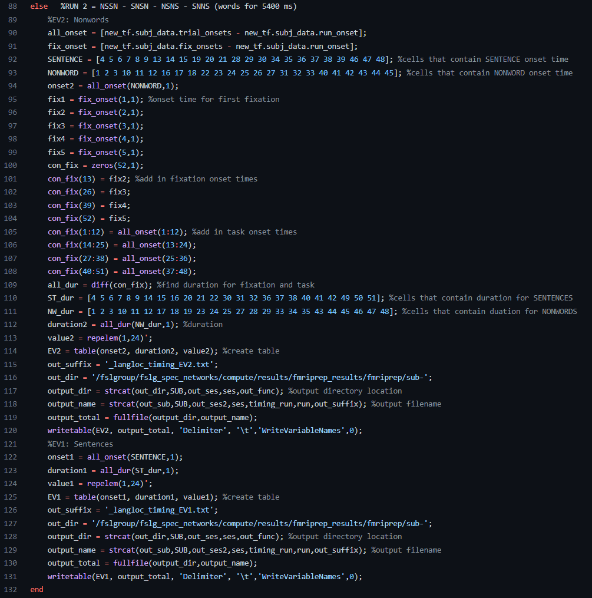
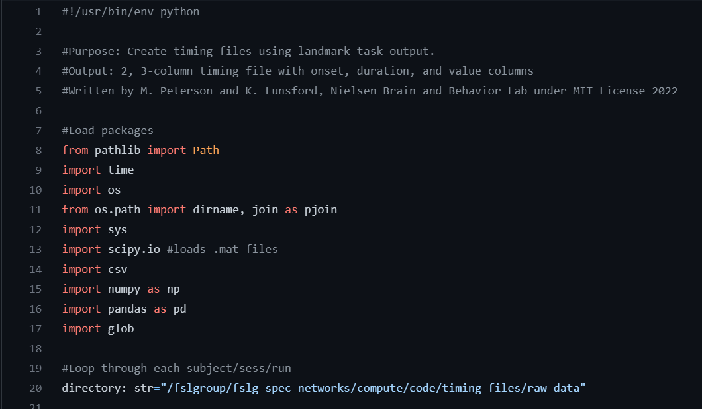
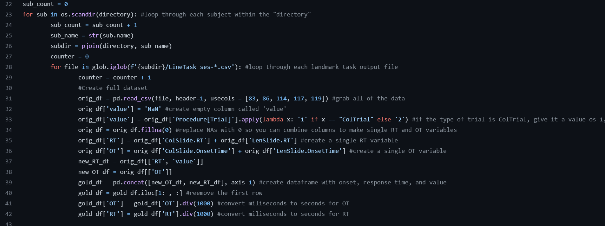
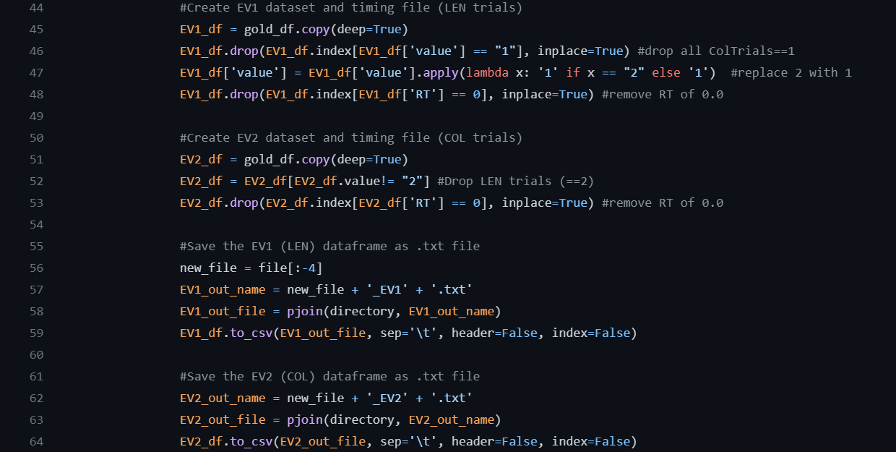

Task Analysis Step 1: Timing Files
==================================

What are timing files?
**********************

Timing files are simple text files that contain the start time of a task trial, the duration of that trial, and the task contrast. 

For example, let's use a language localizer task. For this task, participants read sentences with words and strings of nonwords. So, our trial onset times will be whenever the sentences or nonwords are shown on the screen, the trial durations are the length of time the sentence or nonwords blocks are shown, and the task contrast label will indicate if it is a sentence or nonwords trial. This task can be downloaded from the EvLab `website <https://evlab.mit.edu/funcloc/>`__. 

Creating timing files
*********************

It is best to design your experiment with your first-level model in mind (and hence the timing files, which contribute to the formulation of that design). However, if you are using data that has been previously collected, it can be a little tricky to know where to start with these. However, this can be simplified into three basic steps:

1. Calculate trial onset times
2. Calculate trial durations
3. Label each trial with its particular task contrast label 

We will create these timing files for two different tasks using two different approaches: MATLAB and Python

MATLAB timing files
********************

1. Load MATLAB, claim an `salloc` job, and launch MATLAB

.. code-block:: console
	
    $ ml matlab/r2018b
    $ salloc --mem-per-cpu 15G --time 24:00:00 --x11
    $ LD_PRELOAD= matlab

2. In MATLAB, view our example .mat task output file, which you can download on `Github <https://github.com/peter3200/NeuroDocs/blob/main/example_data/kan_langloc_ses-1_run-1_set1.mat>`__.

.. code-block:: console

    $ load('kan_langloc_ses-1_run-1_set1.mat')

Within the `subj_data` structure, there are a few variables:

.. image:: t1.png 

Here is what each variable means in the context of the language localizer task
   * ``id, set, run: these are defined when the task is run in the scanner``
   * ``run_onset: the beginning of the timer for this run``
   * ``fix_onsets: the value of the timer at the beginnig of each fixation block``
   * ``i_trial_onsets: used to store the expected length of trials``
   * ``trial_onsets: the actual individual trial onset times``
   * ``did_respond: if thte subject actually pressed a key during the attention probe``
   * ``probe_onset: when the participant responds to the attention probe``
   * ``runtime: end time minus start time``
   * ``rt: probe_response minus probe_onset``

.. note:: When time is recorded for this task, it is absolute relative to the internal computer clock, so to get the relative time of trial_onset with respect to run_onset we'll need to calculate trial_onset - run_onset to get a more interpretable value.

3. Create two timing files (EV1 and Ev2). The script is available to lab members on `Github <https://github.com/Nielsen-Brain-and-Behavior-Lab/AutismHemisphericSpecialization/blob/main/activation_maps/timing_files/make_langloc_timing_220407.m>`__.

The first step is to set up paths and basic variables:

.. image:: t2.png

Next, we will load the .mat file and create more variables:

Now we are ready to create different timing files depending on the set. For this task, the trials are presented in a different order depending on if the set is 1 or 2.

If it is the second set (run), then we will create the timing files using this code:

4. Look for and view the output EV files (found in your out_dir, which in this case is the fmriprep results folder)

.. image:: t6.png

Python Timing Files
*******************

We are going to use a different task and a different language to approach timing files! Some background: this "linetask" is a line bisection task, for which participants view a vertical line bisected by a horizontal line. For LENGTH trials, they are asked to select if the top or bottom section of the vertical line is longer. For COLOR trials, they determine if the top or bottom of the vertical line is brighter. Unlike the language task, trial durations are determined by the participant's response speed. 

0. The raw output for this task is in EPrime format. These EPrime files were first converted to .excel files using EPrime and then to .csv files using Excel. You can download an example .csv output file to use with this script from `Github <https://github.com/peter3200/NeuroDocs/blob/main/example_data/LineTask_ses-1_run-2.csv>`__.

1. Load python

.. code-block:: console
   
   $ ml python/3.6

2. Run our script! Lab members can access this script on `Github <https://github.com/Nielsen-Brain-and-Behavior-Lab/AutismHemisphericSpecialization/blob/main/activation_maps/timing_files/make_landmark_timing_x2_220408.py>`__. 

.. code-block:: console

   $ python make_landmark_timing_x2_220408.py

3. Check for output in your output directory (here specified as input folder). There should be two EV files for each run. 

.. image:: t7.png

*What did the python script do?*

- First, we set up our environment, loading the needed modules and setting our input directory

- Next, we set up our `for loops` to loop through each subject and then each landmark task output file within that subject directory. Then we went to work grabbing our timing file components.

- After that, we created two EV files -- one for the LEN trials and one for the COL trials and then saved them in the input directory.

Other Examples of Timing Files
******************************

As a primer with a simplified example, we highly recommend Andy's Brain Book! Check out `Chapter 5 <https://andysbrainbook.readthedocs.io/en/latest/fMRI_Short_Course/Statistics/05_Creating_Timing_Files.html>`__.
