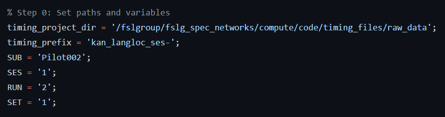

Task Analysis Step 1: Timing Files
==================================

What are timing files?
**********************

Timing files are simple text files that contain the start time of a task trial, the duration of that trial, and the task contrast. 

For example, let's use a language localizer task. For this task, participants read sentences with words and strings of nonwords. So, our trial onset times will be whenever the sentences or nonwords are shown on the screen, the trial durations are the length of time the sentence or nonwords blocks are shown, and the task contrast label will indicate if it is a sentence or nonwords trial.  

Creating timing files
*********************

It is best to design your experiment with your first-level model in mind (and hence the timing files, which contribute to the formulation of that design). However, if you are using data that has been previously collected, it can be a little tricky to know where to start with these. However, this can be simplified into three basic steps:

1. Calculate trial onset times
2. Calculate trial durations
3. Label each trial with its particular task contrast label 

We will create these timing files for two different tasks using two different approaches: MATLAB and Python

MATLAB timing files
********************

1. Load MATLAB, claim an `salloc` job, and launch MATLAB

.. code-block:: console
	
    $ ml matlab/r2018b
    $ salloc --mem-per-cpu 15G --time 24:00:00 --x11
    $ LD_PRELOAD= matlab

2. In MATLAB, view our example .mat task output file, which you can download on `Github <https://github.com/peter3200/NeuroDocs/blob/main/example_data/kan_langloc_ses-1_run-1_set1.mat>`__.

.. code-block:: console

    $ load('kan_langloc_ses-1_run-1_set1.mat')

Within the `subj_data` structure, there are a few variables:

Here is what each variable means
- id, set, run: these are defined when the task is run in the scanner
- run_onset: the beginning of the timer for this run
- fix_onsets: the value of the timer at the beginnig of each fixation block
- i_trial_onsets: used to store the expected length of trials
- trial_onsets: the actual individual trial onset times
- did_respond: if thte subject actually pressed a key during the attention probe
- probe_onset: when the participant responds to the attention probe
- runtime: end time minus start time
- rt: probe_response minus probe_onset

.. note:: Also important to know, when time is recorded for this task, it is absolute relative to the internal computer clock, so to get the relative time of trial_onset with respect to run_onset we'll need to calculate trial_onset - run_onset to get a more interpretable value.

3. Create two timing files (EV1 and Ev2). The script is available to lab members on `Github <https://github.com/Nielsen-Brain-and-Behavior-Lab/AutismHemisphericSpecialization/blob/main/activation_maps/timing_files/make_langloc_timing_220407.m>`__.

The first step is to set up paths and basic variables:

Next, we will load the .mat file and create more variables:

Now we are ready to create different timing files depending on the set. For this task, the trials are presented in a different order depending on if the set is 1 or 2.

If it is the second set (run), then we will create the timing files using this code:

4. Look for and view the output EV files (found in your out_dir, which in this case is the fmriprep results folder)

