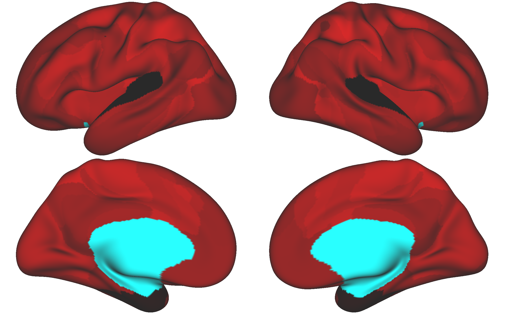
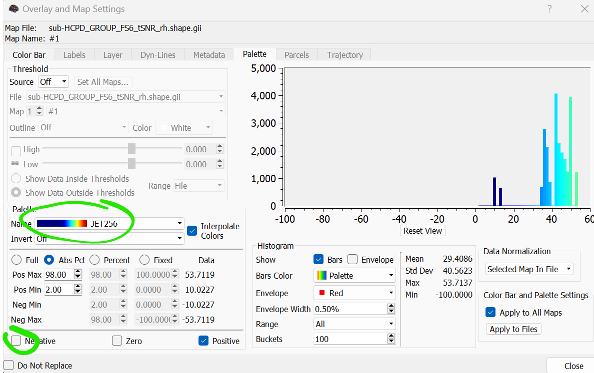
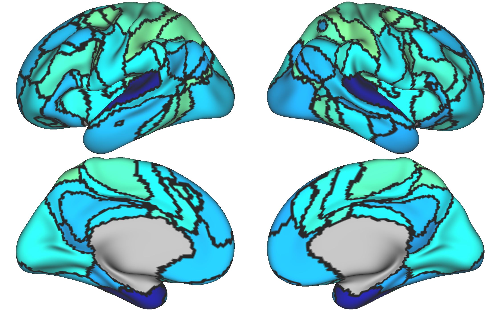

tSNR Step 4: Group-Averaged tSNR Map
====================================

Overview
********

Once we've gathered our network-averaged tSNR values, we can go ahead and create the maps. This will require a few steps (however, a clever programmer could easily find a way to manage these steps in a single script). This workflow includes identifying group-averaged network tSNR values (as opposed to the subject-averaged values that we obtained in step 3), sticking those values in MATLAB objects and saving them out into the GIFTI file format. From here, the GIFTI files can be viewed in HCP Workbench. 

Workflow
********

**Part 1 - Group-averaged values**

Using R or python, or another statistical software, we will average the network tSNR values separately for each hemisphere. Then we will save these values out in two different text files, LH and RH. This is what it could look like in R. 

.. code-block:: bash 

    #Filter to HCP-DISC group
      group_tsnr_disc <- subset(group_tsnr, dataset=="HCP-DISC")
      
      #Avg. tSNR across network
      HCPDISC_LH_MEAN <- aggregate(LH_AVG_SNR ~ Network, data = group_tsnr_disc, FUN = mean)
      HCPDISC_RH_MEAN <- aggregate(RH_AVG_SNR ~ Network, data = group_tsnr_disc, FUN = mean)
      
      #Save out avg as .txt files for LH and RH
      write.csv(HCPDISC_LH_MEAN[2],"C:/Users/maddy/Box/Autism_Hemispheric_Specialization/Analysis/Study1_Dissertation/HCP_analysis/tSNR/HCPDISC/HCPDISC_tSNR_LH_230911.csv",row.names=FALSE, quote=FALSE)
      write.csv(HCPDISC_RH_MEAN[2],"C:/Users/maddy/Box/Autism_Hemispheric_Specialization/Analysis/Study1_Dissertation/HCP_analysis/tSNR/HCPDISC/HCPDISC_tSNR_RH_230911.csv",row.names=FALSE, quote=FALSE)
      
**Part 2 - Create MATLAB objects**

Next, we can use a Python script (3.6) to create a .mat file with lh_labels and rh_labels vectors. This file format was selected since previously created in-house scripts are capable of taking MATLAB vectors and inputting them into the GIFTI file format. Note that we are inputting these averaged tSNR values into every vertex labeled with a specific network label in the group parcellation (so a group parcellation is needed). 

.. code-block:: python 

    #!/usr/bin/env python
    # Purpose: Create a .mat file of vectors with assigned avg tSNR values using MSHBM parc to guide assignment.
    # Input: group parcellation .mat file from Kong2019 pipeline and a 17-item list of avg-tSNR values
    # Output: 1 .mat file with rh_labels and lh_labels of tSNR values
    #
    # Note: Users may need to run 'which python' and paste the correct path following the shebang on line one.
    # Note: Please use python v.3.6. Ex: `ml python/3.6`
    #
    # Written by M. Peterson, Nielsen Brain and Behavior Lab under MIT License 2023

    from pathlib import Path
    import time
    import os
    from os.path import dirname, join as pjoin
    import sys
    import scipy.io #loads .mat files
    import csv
    import numpy as np
    import pandas as pd

    #Read LH and RH SNR .csv file
    lh_df = pd.read_csv('HCPDISC_tSNR_LH_230911.csv')
    rh_df = pd.read_csv('HCPDISC_tSNR_RH_230911.csv')

    # Extract the values as a list
    lh_values = lh_df['LH_AVG_SNR'].tolist()
    rh_values = rh_df['RH_AVG_SNR'].tolist()

    # Set network 0 to -100; network 0 = medial wall)
    lh_values.insert(0, -100)
    rh_values.insert(0, -100)

    count=0
    for network in range(0,18): #Range must be set to actual number of networks +1
            count=(count+1)
            # set sub name
            sub_name='GROUP'

            # path to parcellation output
            test_dir: str="/fslgroup/grp_hcp/compute/HCP_analysis/parc_output_fs6_HCP_DISC/generate_profiles_and_ini_params/group"
            test_name = "DISC_group_matched.mat" #make sure your file is Hungarian-matched!
            test_sub = pjoin(test_dir, test_name)
            test_file = scipy.io.loadmat(test_sub) #Load first sub .mat file
            test_rh = np.squeeze(test_file['rh_labels']) 
            test_rh_list = test_rh.tolist()			
            test_lh = np.squeeze(test_file['lh_labels'])
            test_lh_list = test_lh.tolist()
            
            if count==1:
                new_lh_list = [lh_values[network] if x == network else x for i, x in enumerate(test_lh_list)]
                new_rh_list = [rh_values[network] if x == network else x for i, x in enumerate(test_rh_list)]
            else:
                new_lh_list = [lh_values[network] if x == network else x for i, x in enumerate(new_lh_list)]
                new_rh_list = [rh_values[network] if x == network else x for i, x in enumerate(new_rh_list)]
        
    #Save output to .mat with rh_labels and lh_labels vectors
    scipy.io.savemat('HCPDISC_GROUP_tSNR_230911.mat', {'rh_labels': new_rh_list, 'lh_labels': new_lh_list})

**Part 3- Create GIFTIs**

Next, we can take that .mat file and use the rh_labels and lh_labels to generate RH and LH GIFTI files. Since the GIFTI format is compatible with HCP Workbench, this is the final step before visualization! 

.. code-block:: matlab 

    % Purpose: Convert lh_labels and rh_labels to gifti shape files for later WB
    % visualization
    % Inputs: lh_labels and rh_labels and template gifti
    % files in appropriate resolution. (fsaverage6 optimal) 
    % Outputs: .shape.gii files containing input label values.
    %
    % Note: Template .shape.gii files can be created using mris_vol2surf in
    % combination with bbregister. See the following script: project_surface_FS_AVG_FS6.sh
    %
    % Written by M. Peterson, Nielsen Brain and Behavior Lab, under MIT License 2022

    % To run: 
    %    1. Source the CBIG config script to load GIFTI software
    %	 2. Load matlab module: `ml matlab/r2018b`

    % Set paths and variables
    out_dir = '/fslgroup/fslg_spec_networks/compute/code/HCP_analysis/tSNR/HCP_DISC';
    gifti_template_dir = '/fslgroup/fslg_spec_networks/compute/results/fsaverage_surfaces';

    % Loop through each subject
        sub='HCPDISC_GROUP'

        %load input data
        infile = strcat(sub, '_tSNR_230911.mat');
        inputfull = fullfile(out_dir, infile);
        if isfile(inputfull)
            load(inputfull)
        
            lh_labels = lh_labels';
            rh_labels = rh_labels';
            %grab resolution
            resolution = size(lh_labels,1);
            
            %output filenames
            fname_lh = strcat('sub-', sub, '_FS6_tSNR_lh.shape.gii');
            fname_rh = strcat('sub-', sub, '_FS6_tSNR_rh.shape.gii');
            full_lh = fullfile(out_dir, fname_lh);
            full_rh = fullfile(out_dir, fname_rh);
        
            %load in template .shape.gii file 
            g_left = gifti(fullfile(gifti_template_dir, 'FS6_lh.shape.gii'));
            g_right = gifti(fullfile(gifti_template_dir, 'FS6_rh.shape.gii'));
        
            %replace vertex values in templates with values
            metric = single(ones(resolution, 1));
            g_left.cdata = metric;
            g_right.cdata = metric;
            g_left.cdata = lh_labels;
            g_right.cdata = rh_labels;
        
            %save output
            save(g_left, char(full_lh));
            save(g_right, char(full_rh));
        else
        end

**Part 4- Workbench Visualization** 

The GIFTI files are simple to load in HCP Workbench. First, load your surface underlays (fsaverage6 surface files are available on GitHub https://github.com/peter3200/NeuroDocs/tree/main/example_data). Next, load your GIFTI shape files.

The files might look strange when first loaded. 

Luckily, we can adjust the color palette to better distinguish the networks with the best and worst SNR. 

We can also add the group parcellation GIFTI files to delineate the network boundaries more clearly. 

The tSNR maps are complete!
