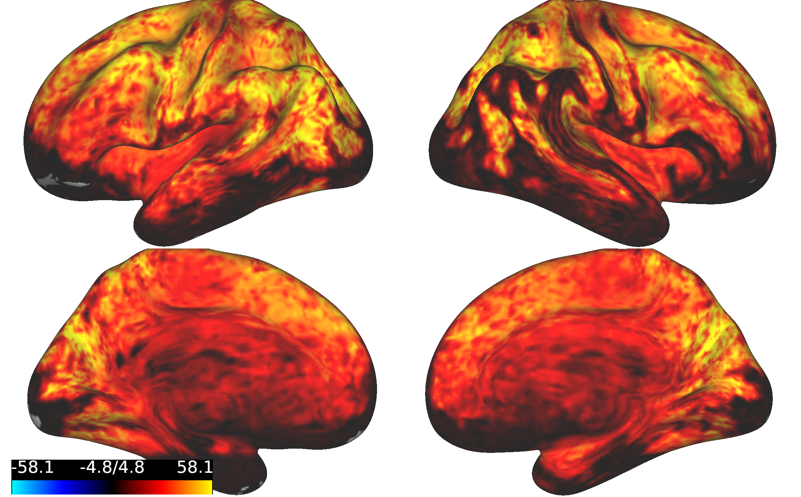

tSNR Maps Overview
==================

Purpose
*******
Temporal signal-to-noise ratio (tSNR) maps provide a glimpse into the quality of your data. They indicate where in the brain you are getting the most signal versus noise. This can be very helpful when you what to understand what may be driving poor test-retest reliability in certain areas, when you are planning scan length, or when you want to know if you can trust an MRI-based measurement in a specific region. Certain areas of the brain, such as those that are close to sinuses or air (such as the orbitofrontal cortex, areas of temporal cortex, etc.), are known to be susceptible to signal fallout. tSNR maps provide a way to visualize and quantify that fallout.

tSNR is calculated by taking the mean BOLD signal for a timeseries and dividing it by the standard deviation of the BOLD signal. 

Prerequisite Software
*********************

To use the scripts in this tutorial, you will need the following software packages. 

1. FSL (specifically, fslmaths)
2. FreeSurfer 
3. MATLAB/r2018b 
4. R or an equivalent statistical package
5. HCP Workbench (specifically, wb_view)

Prerequisite Processing
***********************

The first two steps of this workflow will assume that the data have been preprocessed (specifically by the CBIG2016 pipeline, but this can be adapted). If you desire to average tSNR within individual network parcellation boundaries, a parcellation will be required (such as the Kong2019 pipeline; Step 3). 

Workflow
********

Fortunately, the steps are fairly straightforward. 

1. Using fslmaths, we will calculate the tSNR for each run  for each subject.
2. Using FreeSurfer functions, we will project the tSNR maps to the fsaverage6 surface (adaptable to other resolutions, but they need to be compatible with your parcellation resoluiton). 
3. Using MATLAB, we will generate a subject-averaged tSNR .mat file, and a .csv file containing the network-averaged tSNR for each subject. This step requires individual parcellations as input.
4. Using a combination of R, Python, and MATLAB, we will generate group-averaged maps.

Example Output
**************

Here is one example of a tSNR map from an HCP subject based on one run of data. This was visualized in HCP Workbench using the colorscale RY-BC-BL. The contrast is striking!

